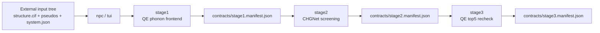

# Nonlinear Phonon Calculation Beta

[English](README.md) | [中文](README_zh.md)

This beta is a structural rewrite of the staged workflow. It keeps the public
stable release untouched and focuses on one thing: make the package operate as
two clean trees driven by `npc`, instead of a bundle full of mixed-in sample
inputs and hand-edited contracts.

For the current call-path view of the beta tree, see
[ARCHITECTURE.md](/Users/lmtsakura/qiyan_shared/testing/Nonlinear-Phonon-Calculation-tui-beta/ARCHITECTURE.md).

The intended user experience is:

1. prepare one system directory under an external input root
2. run `npc`
3. choose the system and the stage
4. let the workflow create its own QE inputs, internal contracts, and run tree

The operator should not need to understand `stage1_manifest.json` or
`stage2_manifest.json` before the first run. Those files still exist, but they
are internal runtime handoff files.

## What Is In This Beta

This beta separates three concerns.

### 1. Code tree

This repository is the code tree. It contains:

- workflow code
- TUI launcher
- documentation
- input examples
- reusable algorithm modules

It should not contain user-specific CIF files, user-specific pseudopotential
sets, or historical run directories.

### 2. External input tree

User input lives outside the code tree, under an input root such as:

```text
/Users/lmtsakura/qiyan_shared/testing/Nonlinear-Phonon-Calculation-inputs/
  wse2/
    structure.cif
    system.json
    pseudos/
      W.pz-spn-rrkjus_psl.1.0.0.UPF
      Se.pz-n-rrkjus_psl.0.2.UPF
```

Each system directory is self-contained.

### 3. Runtime tree

Each run creates its own runtime tree under a runs root, for example:

```text
.../Nonlinear-Phonon-Calculation-runs/
  wse2/
    wse2_20260331_235959/
      contracts/
      logs/
      stage1/
      stage2/
      stage3/
```

The runtime tree is where internal contracts and stage outputs live. It is not
the user input tree.

## Quick Start

### Prepare one system directory

Use the bundled WSe2 example as a template:

- [examples/wse2_input_example/README.md](/Users/lmtsakura/qiyan_shared/testing/Nonlinear-Phonon-Calculation-tui-beta/examples/wse2_input_example/README.md)

At minimum, each system needs:

- `structure.cif`
- `system.json`
- `pseudos/*.UPF`

### Run the TUI

From the beta root:

```bash
./install.sh
npc --input-root /Users/lmtsakura/qiyan_shared/testing/Nonlinear-Phonon-Calculation-inputs --system wse2
```

You can also use the compatibility entrypoints:

```bash
./tui --input-root /Users/lmtsakura/qiyan_shared/testing/Nonlinear-Phonon-Calculation-inputs --system wse2
python3 start_release.py --input-root /Users/lmtsakura/qiyan_shared/testing/Nonlinear-Phonon-Calculation-inputs --system wse2
```

### Common stage-specific commands

Run only stage1:

```bash
python3 start_release.py \
  --input-root /Users/lmtsakura/qiyan_shared/testing/Nonlinear-Phonon-Calculation-inputs \
  --system wse2 \
  --stage stage1 \
  --qe-relax yes
```

Continue the latest run with stage2:

```bash
python3 start_release.py \
  --input-root /Users/lmtsakura/qiyan_shared/testing/Nonlinear-Phonon-Calculation-inputs \
  --system wse2 \
  --stage stage2
```

Continue the latest run with stage3:

```bash
python3 start_release.py \
  --input-root /Users/lmtsakura/qiyan_shared/testing/Nonlinear-Phonon-Calculation-inputs \
  --system wse2 \
  --stage stage3
```

The launcher chooses the latest run root for the selected system unless
`--run-root` is provided explicitly.

Show read-only status for the latest detected run:

```bash
npc --status
```

Show status for a specific system or run root:

```bash
npc --input-root /Users/lmtsakura/qiyan_shared/testing/Nonlinear-Phonon-Calculation-inputs --system wse2 --status
npc --run-root /Users/lmtsakura/qiyan_shared/testing/Nonlinear-Phonon-Calculation-runs/wse2/wse2_20260331_235959 --status
```

Export a cross-machine handoff after stage1 or stage2:

```bash
npc --handoff-export stage1 --run-root /path/to/run_root --output /tmp/wse2_stage1_handoff.tar.gz
npc --handoff-export stage2 --run-root /path/to/run_root --output /tmp/wse2_stage2_handoff.tar.gz
```

Import a handoff bundle on another machine:

```bash
npc --handoff-import --bundle /tmp/wse2_stage1_handoff.tar.gz --run-root /path/to/new_run_root
```

Run convergence tuning for the selected workflow family:

```bash
python3 start_release.py \
  --input-root /Users/lmtsakura/qiyan_shared/testing/Nonlinear-Phonon-Calculation-inputs \
  --system wse2 \
  --stage tune \
  --qe-relax no
```

## Workflow Model



### Stage 1

`stage1` now starts from `structure.cif`, not from a package-internal
`scf.inp`.

The beta path is:

1. read `structure.cif`, `system.json`, and `pseudos/`
2. generate an internal QE input under the runtime tree
3. optionally run QE relax
4. run the phonon frontend
5. extract screened eigenvectors
6. generate `mode_pairs.selected.json`
7. write `contracts/stage1.manifest.json`

### Tuning

`tune` is a TUI-driven helper stage for convergence testing.

It uses `workflow_family` from `system.json`, runs a family-aware QE parameter
scan, and writes reusable profile selections into the stage1 runtime bundle.
Those selected profiles are then picked up automatically by
`qe_phonon_stage1_server_bundle/step1_frontend.py`.

### Stage 2

`stage2` reads `contracts/stage1.manifest.json` from the selected run root and
produces CHGNet ranking outputs plus `contracts/stage2.manifest.json`.

### Stage 3

`stage3` reads `contracts/stage2.manifest.json`, prepares QE top-5 recheck
jobs, and writes `contracts/stage3.manifest.json` as soon as preparation is
complete.

If `stage3/qe/<backend>/run_manifest.json` already exists, rerunning `npc`
reuses that prepared QE batch instead of regenerating inputs. If
`results/qe_ranking.json` already exists and submission has fully completed,
`npc` marks the stage as completed and reuses the collected QE result.

`npc --status` prints:

- QE run root
- prepared job count
- submission progress
- final QE state
- resume mode
- top QE ranking rows

This removes the need to inspect `submission_log.json` or `qe_ranking.json`
manually for normal monitoring.

## Cross-machine handoff

This beta now treats cross-machine continuation as an explicit first-class
workflow instead of an operator-only directory copy.

Recommended split:

1. run `stage1` on `159.226.208.67`
2. export a `stage1` handoff bundle
3. import that bundle on `100.101.235.12`
4. run `stage2`
5. export a `stage2` handoff bundle or continue in place
6. run `stage3` on `100.101.235.12`

The handoff bundle preserves the beta invariant that manifest paths remain
relative to the imported run root.

## Required Input Files

Each system directory must contain:

- `structure.cif`
- `system.json`
- `pseudos/*.UPF`

The current `system.json` schema is intentionally small:

```json
{
  "system_id": "wse2",
  "formula": "WSe2",
  "workflow_family": "tmd_monolayer_hex",
  "preferred_pseudos": {
    "W": "W.pz-spn-rrkjus_psl.1.0.0.UPF",
    "Se": "Se.pz-n-rrkjus_psl.0.2.UPF"
  },
  "already_relaxed": false,
  "notes": "Optional free-form note"
}
```

## Directory Layout

- `nonlinear_phonon_calculation/`
  - CLI entrypoints and input discovery
- `server_highthroughput_workflow/`
  - stage orchestration, runtime preparation, manifests, and the stage2/3 pipeline helper
- `qe_phonon_stage1_server_bundle/`
  - real phonon frontend runtime used by stage1, including convergence tuning
- `qe_modepair_handoff_workflow/`
  - QE preparation and collection helpers for stage3
- `mlff_modepair_workflow/`
  - CHGNet screening code used by stage2
- `examples/wse2_input_example/`
  - user-facing example input directory

## Current Scope

This beta does not try to hide that cross-machine handoff still exists. It only
moves that handoff into the runtime tree and puts `npc` in charge of it.

It also does not replace the public stable release. This is the restructuring
surface where the cleaner input model is being validated.
