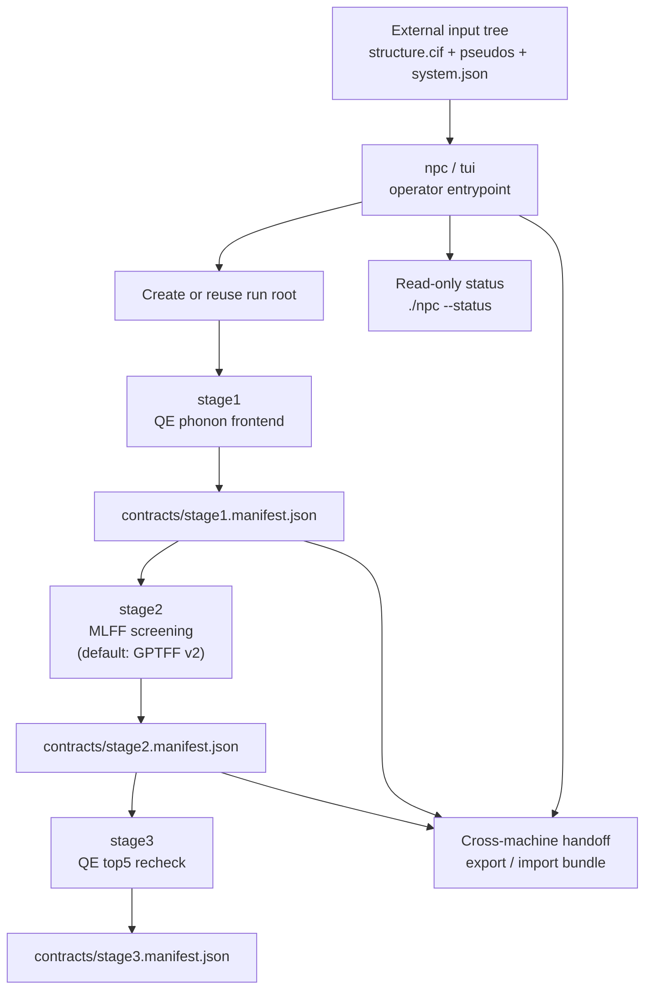

# Nonlinear Phonon Calculation

[English](README.md) | [中文](README_zh.md)

`npc` is the operator entrypoint for a staged workflow that separates:

1. phonon frontend generation (`stage1`)
2. MLFF screening (`stage2`)
3. QE top-5 recheck (`stage3`)

The repository is designed for structured production runs. User input lives
outside the repository. Runtime contracts and stage outputs live under a run
root created by the workflow itself.

For the current call-path view, see [ARCHITECTURE.md](ARCHITECTURE.md).

## Scope

This package is intended for workflows in which:

- the structure is supplied as `structure.cif`
- pseudopotentials are supplied explicitly by the operator
- `stage1`, `stage2`, and `stage3` may run on different machines
- cross-machine continuation is handled by explicit handoff bundles

The package does not hide cross-machine continuation. It formalizes it.

## Input Specification

Each system must be prepared under an external input root:

```text
<input_root>/
  <system_id>/
    structure.cif
    system.json
    pseudos/
      *.UPF
```

Minimal required files:

- `structure.cif`
- `system.json`
- `pseudos/*.UPF`

Example input tree:

- [examples/wse2_input_example/README.md](examples/wse2_input_example/README.md)

Minimal `system.json` schema:

```json
{
  "system_id": "wse2",
  "formula": "WSe2",
  "workflow_family": "tmd_monolayer_hex",
  "preferred_pseudos": {
    "W": "W.pz-spn-rrkjus_psl.1.0.0.UPF",
    "Se": "Se.pz-n-rrkjus_psl.0.2.UPF"
  },
  "already_relaxed": false,
  "notes": "Optional free-form note"
}
```

## Runtime Layout

Each run creates a runtime tree under a runs root:

```text
.../Nonlinear-Phonon-Calculation-runs/
  <system_id>/
    <run_tag>/
      contracts/
      logs/
      stage1/
      stage2/
      stage3/
```

Key principle:

- user input stays in the external input tree
- workflow state stays in the runtime tree
- internal contracts are runtime artifacts, not user-authored inputs

## Installation

From the repository root:

```bash
./install.sh
```

Repository-local execution:

```bash
./npc --help
```

If the user install location is already on `PATH`, the installed entrypoint is
equivalent:

```bash
npc --help
```

Compatibility entrypoints are also provided:

```bash
./tui --help
python3 start_release.py --help
```

## Software Environment

This package does not assume a site-specific environment name. The required
interface is a set of executables and Python modules available in the shell
that launches `npc`.

One-command stage environment scripts are provided under:

- `ops/setup_stage1_env.sh`
- `ops/setup_stage2_env.sh`
- `ops/setup_stage3_env.sh`

These scripts configure the Python side of the workflow in the current shell
environment and then validate stage-specific external requirements.

### Base requirements

- `python3`
- `python3 -m pip`
- `git`
- a successful `./install.sh`

### Stage-specific requirements

- `stage1`
  - run `bash ops/setup_stage1_env.sh`
  - `pw.x`
  - `ph.x`
  - `q2r.x`
  - `matdyn.x`
  - `sbatch`
  - `squeue`
- `stage2`
  - run `bash ops/setup_stage2_env.sh`
  - importable Python modules:
    - `gptff`
    - `chgnet`
    - `torch`
    - `phonopy`
    - `pymatgen`
- `stage3`
  - run `bash ops/setup_stage3_env.sh`
  - QE executables on `PATH`
  - if `submit_collect` is used:
    - `sbatch`
    - `squeue`
    - a Slurm runtime suitable for batch QE work

### Operational guidance

- `stage1` depends on Slurm in the current implementation. It is not a pure
  local frontend runner.
- `stage1` is the most demanding stage with respect to QE phonon frontend
  stability. Run it on a host already known to execute `ph.x` reliably.
- `stage2` is primarily a Python materials-stack workload and is comparatively
  easy to migrate once `stage1` has produced a valid contract.
- `stage2` supports three model presets:
  - `gptff_v1`
  - `gptff_v2`
  - `chgnet`
- The default `stage2` model preset is `gptff_v2`.
- `stage3` supports two modes:
  - `prepare_only`
  - `submit_collect`
- `stage3 --qe-mode prepare_only` can be prepared without Slurm, but
  `submit_collect` requires Slurm.

If your site uses Conda, modules, or environment scripts, activate that
environment first and only then launch `npc`. This README deliberately does not
prescribe a site-local activation command.

### Example environment setup commands

Stage 1 host:

```bash
bash ops/setup_stage1_env.sh
```

Stage 2 host:

```bash
GPTFF_SOURCE=/path/to/GPTFF bash ops/setup_stage2_env.sh
```

Stage 3 host for queue submission:

```bash
bash ops/setup_stage3_env.sh
```

Stage 3 host for preparation only:

```bash
STAGE3_MODE=prepare_only bash ops/setup_stage3_env.sh
```

## Command Reference

### Start the interactive launcher

```bash
./npc --input-root /path/to/Nonlinear-Phonon-Calculation-inputs --system wse2
```

### Run `stage1`

```bash
./npc \
  --input-root /path/to/Nonlinear-Phonon-Calculation-inputs \
  --system wse2 \
  --stage stage1 \
  --qe-relax yes
```

### Run `stage2` on the latest run of a system

```bash
./npc \
  --input-root /path/to/Nonlinear-Phonon-Calculation-inputs \
  --system wse2 \
  --stage stage2
```

This command uses `gptff_v2` by default.

### Select the `stage2` model preset

Available presets:

- `gptff_v1`
- `gptff_v2`
- `chgnet`

Examples:

```bash
./npc \
  --input-root /path/to/Nonlinear-Phonon-Calculation-inputs \
  --system wse2 \
  --stage stage2 \
  --stage2-model gptff_v1
```

```bash
./npc \
  --input-root /path/to/Nonlinear-Phonon-Calculation-inputs \
  --system wse2 \
  --stage stage2 \
  --stage2-model chgnet
```

### Run `stage3`

```bash
./npc \
  --input-root /path/to/Nonlinear-Phonon-Calculation-inputs \
  --system wse2 \
  --stage stage3
```

### Prepare the QE recheck batch without submission

```bash
./npc \
  --input-root /path/to/Nonlinear-Phonon-Calculation-inputs \
  --system wse2 \
  --stage stage3 \
  --qe-mode prepare_only
```

### Resume an existing `stage3` run

```bash
./npc \
  --run-root /path/to/run_root \
  --stage stage3 \
  --qe-mode submit_collect
```

### Read-only status inspection

Latest detected run:

```bash
./npc --status
```

Specific system or run root:

```bash
./npc --input-root /path/to/Nonlinear-Phonon-Calculation-inputs --system wse2 --status
./npc --run-root /path/to/Nonlinear-Phonon-Calculation-runs/wse2/wse2_20260331_235959 --status
```

### Export handoff bundles

After `stage1`:

```bash
./npc --handoff-export stage1 --run-root /path/to/run_root --output /tmp/wse2_stage1_handoff.tar.gz
```

After `stage2`:

```bash
./npc --handoff-export stage2 --run-root /path/to/run_root --output /tmp/wse2_stage2_handoff.tar.gz
```

### Import a handoff bundle

```bash
./npc --handoff-import --bundle /tmp/wse2_stage1_handoff.tar.gz --run-root /path/to/new_run_root
```

### Run convergence tuning

```bash
./npc \
  --input-root /path/to/Nonlinear-Phonon-Calculation-inputs \
  --system wse2 \
  --stage tune \
  --qe-relax no
```

## Stage Definitions

### `stage1`

Input:

- `structure.cif`
- `system.json`
- `pseudos/*.UPF`

Actions:

1. generate internal QE inputs
2. optionally run QE relax
3. run the QE phonon frontend
4. extract screened eigenvectors
5. select modes
6. generate mode pairs
7. write `contracts/stage1.manifest.json`

Primary outputs:

- `stage1/outputs/mode_pairs.selected.json`
- `contracts/stage1.manifest.json`

### `tune`

`tune` is a family-aware convergence stage. It reads `workflow_family` from
`system.json`, runs the configured scan, and writes reusable profile selections
into the stage1 runtime bundle.

### `stage2`

Input:

- `contracts/stage1.manifest.json`

Actions:

1. load the imported or locally generated stage1 contract
2. run stage2 MLFF screening with the selected model preset
3. rank candidate mode pairs
4. write `contracts/stage2.manifest.json`

Primary outputs:

- `stage2/outputs/<backend>/screening/pair_ranking.csv`
- `stage2/outputs/<backend>/screening/single_backend_ranking.json`
- `contracts/stage2.manifest.json`

### `stage3`

Input:

- `contracts/stage2.manifest.json`

Actions:

1. select the top-5 pairs
2. prepare QE recheck jobs
3. optionally submit and collect them
4. write `contracts/stage3.manifest.json`

Behavior:

- if a QE batch has already been prepared, rerunning `npc` reuses it
- if final QE collection already exists, rerunning `npc` reuses the completed result

Primary outputs:

- `stage3/qe/<backend>/run_manifest.json`
- `contracts/stage3.manifest.json`
- `stage3/qe/<backend>/results/qe_ranking.json` when collection finishes

## Monitoring

`./npc --status` reports:

- discovered stage contracts
- `stage1` handoff summary
- `stage2` ranking summary
- `stage3` QE run root
- prepared job count
- submission progress
- final QE state
- resume mode

For normal operation, `--status` should be the first inspection command. Manual
inspection of lower-level runtime files should only be needed for debugging.

## Cross-machine Handoff

Recommended operator sequence:

1. run `stage1` on a machine with a stable QE phonon frontend
2. export a `stage1` handoff bundle
3. import it on a machine prepared for `stage2`
4. run `stage2`
5. either continue in place or export a `stage2` handoff bundle
6. import on the machine intended for `stage3`
7. run `stage3`

The handoff bundle preserves relative runtime paths by rewriting them against
the imported run root. Cross-machine continuation should therefore use
`--handoff-export` and `--handoff-import`, not manual directory copying.

## Workflow Model



## Repository Layout

- `nonlinear_phonon_calculation/`
  - CLI entrypoints and input discovery
- `server_highthroughput_workflow/`
  - orchestration, runtime preparation, manifests, and stage2/3 helpers
- `qe_phonon_stage1_server_bundle/`
  - stage1 phonon frontend and convergence tooling
- `mlff_modepair_workflow/`
  - stage2 MLFF screening logic for GPTFF and CHGNet backends
- `qe_modepair_handoff_workflow/`
  - stage3 QE preparation and collection helpers
- `examples/wse2_input_example/`
  - user-facing input example
