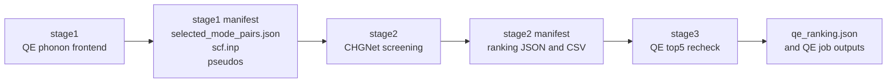
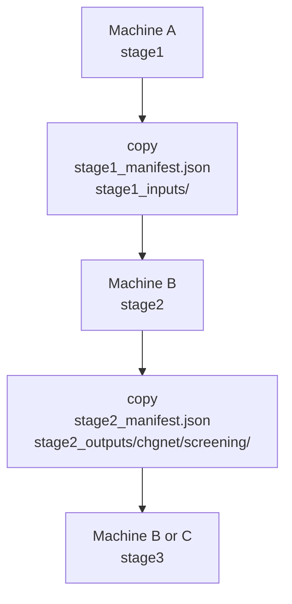

# Nonlinear Phonon Calculation

[English](README.md) | [中文](README_zh.md)

This package is a staged workflow for nonlinear phonon screening and QE recheck.
It is built for the practical case where one machine is good at phonon frontend
work and another machine is better suited for screening and large batches of QE
single-point jobs.

The bundle is organized around three explicit stages:

- `stage1`: start from `scf.inp`, run the QE phonon frontend, and generate
  `selected_mode_pairs.json`
- `stage2`: read the `stage1` handoff files and rank candidate mode pairs with
  CHGNet
- `stage3`: read the `stage2` handoff files and launch QE top-5 recheck jobs

This is the stable operator-facing bundle. It does not ship local caches,
historical run directories, or golden-reference benchmark data.

## Quick Start

### 1. Install the bundle

From the bundle root:

```bash
./install.sh
```

For a packaging-validation install:

```bash
NPC_INSTALL_MODE=wheel ./install.sh
```

The operator-facing command is:

```bash
npc
```

Compatibility entrypoints are still present:

```bash
./tui
python3 start_release.py
```

### 2. Recommended host split

- `stage1`: a Slurm host suited for the QE phonon frontend
- `stage2` and `stage3`: a machine suited for CHGNet screening and QE batch jobs

This split is intentional.

- `stage1` is the expensive phonon frontend and is best run on a host with a
  stable Slurm setup for `pw.x`, `ph.x`, `q2r.x`, and `matdyn.x`.
- `stage2` is CPU screening and benefits from a machine with predictable CPU
  throughput and thread control.
- `stage3` is a large batch of QE single-point jobs and is easier to manage
  independently from the phonon frontend.

The bundle does not automate SSH handoff. Machines are joined by copying the
contract files under `release_run/`.

### Packaging target: user-facing cross-machine handoff

The next packaged `tui/npc` target has already been validated in the beta tree
as a user-facing command flow. The intended commands are:

```bash
npc --handoff-export stage1 --run-root <run_root> --output <stage1_bundle.tar.gz>
npc --handoff-export stage2 --run-root <run_root> --output <stage2_bundle.tar.gz>
npc --handoff-import --bundle <bundle.tar.gz> --run-root <new_run_root>
npc --run-root <new_run_root> --status
```

Validated machine split:

- `stage1`: `159.226.208.67:33223`
- `stage2/3`: `100.101.235.12`
- recommended runtime env on `100.101.235.12`: `qiyan-ht`

The full integration and packaging handoff spec is recorded in:

- [packaging/TUI_CROSS_MACHINE_BUILD_SPEC_2026-03-31.md](packaging/TUI_CROSS_MACHINE_BUILD_SPEC_2026-03-31.md)

### 3. Fastest path to a real run

On the stage1 machine:

```bash
npc
```

Choose:

- `Run QE structure relaxation first?` -> `yes`
- `Which stage to run?` -> `stage1`

This produces:

- `release_run/stage1_manifest.json`
- `release_run/stage1_inputs/`

Copy those two items to the stage2/3 machine, then run:

```bash
python3 server_highthroughput_workflow/run_modular_pipeline.py \
  --stage stage2 \
  --run-root /path/to/release_run \
  --runtime-profile medium
```

Then continue with:

```bash
python3 server_highthroughput_workflow/run_modular_pipeline.py \
  --stage stage3 \
  --run-root /path/to/release_run \
  --qe-mode submit_collect
```

If you only want to confirm that stage3 prepares the QE batch correctly:

```bash
python3 server_highthroughput_workflow/run_modular_pipeline.py \
  --stage stage3 \
  --run-root /path/to/release_run \
  --qe-mode prepare_only
```

## What The Package Actually Does

The workflow is deliberately staged because the three parts solve different
problems.



### Stage 1

`stage1` is the phonon frontend. It takes the crystal structure, runs the QE
phonon stack, extracts the screened eigenvectors, and produces the mode-pair
input used by later stages.

The default stage1 path is:

1. optional `vc-relax`
2. screen the q-point set used for the nonlinear workflow
3. run `pw.x -> ph.x -> q2r.x -> matdyn.x`
4. extract eigenvectors and frequencies
5. select candidate mode pairs
6. package the handoff files

The current stable defaults use the convergence-tested balanced phonon profile:

- `ecutwfc = 100`
- `ecutrho = 1000`
- `primitive_k_mesh = 12x12x1`
- `conv_thr = 1.0d-10`
- `degauss = 1.0d-10`
- `q-grid = 6x6x1`

### Stage 2

`stage2` reads the `stage1` handoff and runs CHGNet screening on the generated
mode pairs. It does not need the original stage1 run directory. It only needs
the packaged contract.

The default stable path uses:

- `strategy = coarse_to_fine`
- `coarse_grid_size = 5`
- `full_grid_size = 9`
- `refine_top_k = 24`
- `batch_size = 16`
- `num_workers = 2`
- `torch_threads = 16`

The output is a ranking of mode pairs, written both as CSV and JSON.

### Stage 3

`stage3` reads the `stage2` manifest, selects the top 5 candidates, generates
QE input directories, and optionally submits the full recheck batch.

The stable default is:

- `top_n = 5`
- QE preset `pes_fast`

`stage3` now writes `stage3_manifest.json` as soon as the QE batch is prepared.
It does not wait for the whole batch to finish before recording the handoff.

## File Contracts

The key design rule of this package is that each stage can hand off to the next
one by copying a small, explicit file set.

### Stage 1 -> Stage 2

Required files:

- `release_run/stage1_manifest.json`
- `release_run/stage1_inputs/structure/scf.inp`
- `release_run/stage1_inputs/pseudos/*.UPF`
- `release_run/stage1_inputs/mode_pairs/selected_mode_pairs.json`

### Stage 2 -> Stage 3

Required files:

- `release_run/stage2_manifest.json`
- `release_run/stage2_outputs/chgnet/screening/pair_ranking.csv`
- `release_run/stage2_outputs/chgnet/screening/pair_ranking.json`
- `release_run/stage2_outputs/chgnet/screening/single_backend_ranking.json`

This is what makes cross-machine resume practical. You do not need to keep the
entire previous machine state alive.



## Recommended Commands

### Full interactive launcher

```bash
npc
```

Use this when you want the package to guide the run interactively.

### Explicit stage execution

Run from the bundle root:

```bash
python3 server_highthroughput_workflow/run_modular_pipeline.py --stage stage1 --run-root /path/to/release_run
python3 server_highthroughput_workflow/run_modular_pipeline.py --stage stage2 --run-root /path/to/release_run --runtime-profile medium
python3 server_highthroughput_workflow/run_modular_pipeline.py --stage stage3 --run-root /path/to/release_run --qe-mode prepare_only
```

Common useful options:

- `--runtime-profile small|medium|large|default`
- `--runtime-config /path/to/runtime.json`
- `--scheduler auto|slurm|local`
- `--qe-mode prepare_only|submit_collect`
- `--top-n 5`

## Directory Layout

The bundle root is meant to be readable. The most important directories are:

- `qe_phonon_stage1_server_bundle/`
  - real stage1 runtime
- `server_highthroughput_workflow/`
  - stage2 and stage3 orchestration
- `qe_modepair_handoff_workflow/`
  - QE batch preparation, submission, and collection helpers
- `examples/wse2/`
  - bundled WSe2 example and contract sample
- `nonlocal phonon/`
  - default structure and pseudopotentials shipped with the package

## WSe2 Example

`examples/wse2/` is the reference example shipped with the stable bundle.

It includes:

- a minimal `scf.inp`
- pseudopotentials
- a contract-style `stage1_manifest.json`
- a contract-style `stage2_manifest.json`
- a small set of ranking outputs for handoff inspection

It is meant to show:

- how the handoff files are organized
- what later stages expect to read
- how to replace example inputs with your own run products

It is not a bundled full production run.

See:

- [examples/wse2/README.md](examples/wse2/README.md)
- [examples/wse2/README_zh.md](examples/wse2/README_zh.md)

## Operational Notes

- `stage1` is designed for the older multi-node cluster because `ph.x` has been
  more stable there.
- `stage2` and `stage3` are designed to be resumable from file contracts.
- The stable bundle does not depend on the removed golden-reference dataset.
- The stable bundle does not include historical run caches or local benchmark
  directories.

## Where To Read Next

- Stage1 details:
  - [qe_phonon_stage1_server_bundle/README.md](qe_phonon_stage1_server_bundle/README.md)
  - [qe_phonon_stage1_server_bundle/README_zh.md](qe_phonon_stage1_server_bundle/README_zh.md)
- Stage2 and Stage3 details:
  - [server_highthroughput_workflow/README.md](server_highthroughput_workflow/README.md)
  - [server_highthroughput_workflow/README_zh.md](server_highthroughput_workflow/README_zh.md)
- Chinese version:
  - [README_zh.md](README_zh.md)
