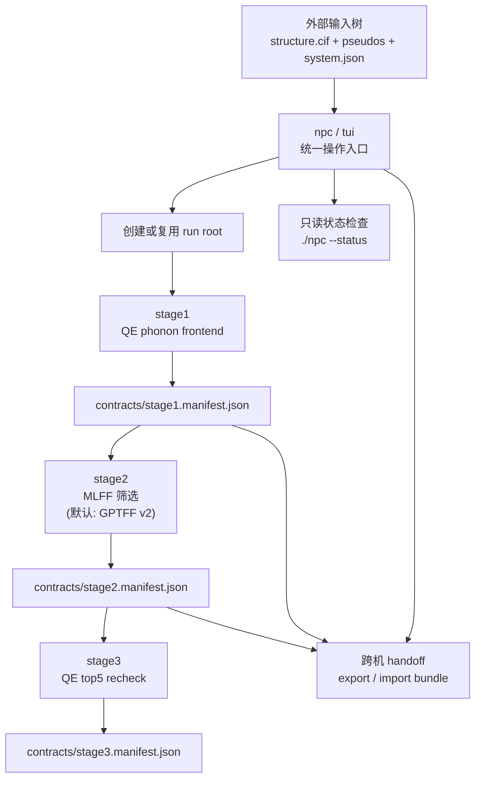

# Nonlinear Phonon Calculation

[English](README.md) | [中文](README_zh.md)

`npc` 是本项目的统一操作入口，用于驱动一个分阶段工作流：

1. 声子前端生成（`stage1`）
2. MLFF 筛选（`stage2`）
3. QE top-5 复核（`stage3`）

本仓库面向规范化计算流程。用户输入保存在仓库外部；运行时 contract 与阶段产物由工作流在运行目录中自动生成。

当前主线调用结构见：
- [ARCHITECTURE.md](ARCHITECTURE.md)

## 当前正式版能力概览

当前 stable 代码线已经把下面这些面向操作者的能力收进同一套入口：

- 统一入口 `npc`
  - 覆盖 `stage1`、`stage2`、`stage3`、状态查询以及跨机 handoff
- 运行时 contract
  - 每个阶段都把关键状态写入 `contracts/`，后续阶段直接复用，不要求操作者手工重建上下文
- 四种 `stage2` 模型预设
  - `gptff_v1`
  - `gptff_v2`
  - `chgnet`
  - `mattersim_v1_5m`
- `stage2` 默认模型预设
  - `gptff_v2`
- `stage3` 的 prepare / reuse / submit 语义
  - `prepare_only`
  - `submit_collect`
- 本地 `stage2` 与远端/参考 `stage3` 的 comparison 输出
  - 保持统一 schema，便于后续分析和报告生成

因此，这个仓库同时承担两类职责：

- 通过 `npc` 运行正式工作流
- 通过 `reports/` 下的脚本做离线 benchmark 与结果分析

## 代码结构总览

阅读这个仓库时，最好把它看成几块明确分工的子系统，而不是一个单体脚本集合。

- `start_release.py`
  - `npc` 背后的薄封装入口
  - 负责解析高层阶段参数，并转发到分阶段运行时
- `server_highthroughput_workflow/`
  - 运行时编排层
  - 负责 stage 分发、run root 结构、handoff import/export、状态输出，以及阶段间 contract 流转
- `qe_phonon_stage1_server_bundle/`
  - `stage1` 声子前端与配套的 q 点/模式筛选工具
- `mlff_modepair_workflow/`
  - `stage2` 的 frozen-phonon 评估、pair ranking 与 reference compare
  - 负责 GPTFF、CHGNet、MatterSim 等 backend 计算器接入
- `qe_modepair_handoff_workflow/`
  - `stage3` 的 QE prepare、submit、collect
- `reports/`
  - 离线表格提取与绘图脚本
  - 这些脚本是工具链，不属于 `npc` 主流程调用路径

## 三个阶段的职责边界

这三个阶段并不是简单串联，而是有明确分工。

- `stage1`
  - 负责生成声子前端产物、候选 mode pair 和 `stage1 contract`
  - 对运行环境最敏感，因为 QE phonon frontend 必须在宿主机上稳定运行
- `stage2`
  - 负责用指定的 MLFF backend 评估 candidate mode-pair grid
  - 输出排序结果以及可直接用于 comparison/report 的 JSON/CSV
- `stage3`
  - 负责对高排名 pair 做 QE 复核准备和提交
  - 设计上直接消费 `stage2` 输出，而不改变 ranking schema

这套拆分是有意为之的：

- `stage2` 不只是 `stage3` 的前处理
- `stage2` 和 `stage3` 本身就是需要相互对照的两层结果

## 适用范围

本包适用于以下场景：

- 结构输入以 `structure.cif` 提供
- 赝势文件由操作者显式提供
- `stage1`、`stage2`、`stage3` 可以部署在不同机器上
- 跨机续算通过显式 handoff bundle 完成

本包不会隐藏跨机续算，而是将其规范化。

## 输入规范

每个体系应在外部输入根目录下准备一个独立目录：

```text
<input_root>/
  <system_id>/
    structure.cif
    system.json
    pseudos/
      *.UPF
```

最小必需文件：

- `structure.cif`
- `system.json`
- `pseudos/*.UPF`

输入样例见：

- [examples/wse2_input_example/README_zh.md](examples/wse2_input_example/README_zh.md)

`system.json` 的最小结构如下：

```json
{
  "system_id": "wse2",
  "formula": "WSe2",
  "workflow_family": "tmd_monolayer_hex",
  "preferred_pseudos": {
    "W": "W.pz-spn-rrkjus_psl.1.0.0.UPF",
    "Se": "Se.pz-n-rrkjus_psl.0.2.UPF"
  },
  "already_relaxed": false,
  "notes": "可选备注"
}
```

## 运行目录结构

每次运行都会在 runs 根目录下生成一个独立运行树：

```text
.../Nonlinear-Phonon-Calculation-runs/
  <system_id>/
    <run_tag>/
      contracts/
      logs/
      stage1/
      stage2/
      stage3/
```

基本原则：

- 用户输入始终保留在外部输入树中
- 工作流状态始终保留在运行树中
- 内部 contract 属于运行时产物，不是用户手工维护的输入文件

## 安装

在仓库根目录执行：

```bash
./install.sh
```

使用仓库内入口执行：

```bash
./npc --help
```

如果用户安装位置已经在 `PATH` 中，也可以直接使用安装后的入口：

```bash
npc --help
```

兼容入口同时保留：

```bash
./tui --help
python3 start_release.py --help
```

## 软件环境

本包不假定任何站点本地环境名。唯一要求是：启动 `npc` 的 shell 必须已经具备所需的可执行程序和 Python 模块。

仓库同时提供了按阶段划分的一键环境脚本：

- `ops/setup_stage1_env.sh`
- `ops/setup_stage2_env.sh`
- `ops/setup_stage3_env.sh`

这些脚本负责在当前 Python 环境中安装本包与所需 Python 依赖，并校验各阶段的外部条件。

### 基础要求

- `python3`
- `python3 -m pip`
- `git`
- 可以成功执行 `./install.sh`

### 分阶段要求

- `stage1`
  - 建议执行：`bash ops/setup_stage1_env.sh`
  - `pw.x`
  - `ph.x`
  - `q2r.x`
  - `matdyn.x`
  - `sbatch`
  - `squeue`
- `stage2`
  - 建议执行：`bash ops/setup_stage2_env.sh`
  - 可导入的 Python 模块：
    - `gptff`
    - `chgnet`
    - `torch`
    - `phonopy`
    - `pymatgen`
- `stage3`
  - 建议执行：`bash ops/setup_stage3_env.sh`
  - QE 可执行文件在 `PATH` 中
  - 若使用 `submit_collect`，还需要：
    - `sbatch`
    - `squeue`
    - 适合批量 QE 作业的 Slurm 调度环境

### 运行建议

- 当前实现中，`stage1` 依赖 Slurm，不是纯本地前端模式。
- `stage1` 对 QE 声子前端的稳定性要求最高，应放在已经验证过 `ph.x` 可稳定运行的宿主上执行。
- `stage2` 主要依赖 Python 材料模拟栈，在 `stage1` contract 已生成后更容易迁移。
- `stage2` 支持四种模型预设：
  - `gptff_v1`
  - `gptff_v2`
  - `chgnet`
  - `mattersim_v1_5m`
- `stage2` 的默认模型预设是 `gptff_v2`。
- `stage3` 支持两种模式：
  - `prepare_only`
  - `submit_collect`
- `stage3 --qe-mode prepare_only` 可以只做准备；真正提交与回收仍依赖 Slurm。

如果站点通过 Conda、module 或其他环境脚本管理软件，请先完成环境激活，再执行 `npc`。本文档不规定任何站点私有的激活命令。

### 环境脚本示例

Stage 1 宿主：

```bash
bash ops/setup_stage1_env.sh
```

Stage 2 宿主：

```bash
GPTFF_SOURCE=/path/to/GPTFF bash ops/setup_stage2_env.sh
```

Stage 3 宿主（提交队列作业）：

```bash
bash ops/setup_stage3_env.sh
```

Stage 3 宿主（仅 prepare，不提交）：

```bash
STAGE3_MODE=prepare_only bash ops/setup_stage3_env.sh
```

## 命令参考

### 启动交互式入口

```bash
./npc --input-root /path/to/Nonlinear-Phonon-Calculation-inputs --system wse2
```

### 运行 `stage1`

```bash
./npc \
  --input-root /path/to/Nonlinear-Phonon-Calculation-inputs \
  --system wse2 \
  --stage stage1 \
  --qe-relax yes
```

### 对体系最新 run 执行 `stage2`

```bash
./npc \
  --input-root /path/to/Nonlinear-Phonon-Calculation-inputs \
  --system wse2 \
  --stage stage2
```

该命令默认使用 `gptff_v2`。

### 选择 `stage2` 模型预设

可选预设：

- `gptff_v1`
- `gptff_v2`
- `chgnet`
- `mattersim_v1_5m`

示例：

```bash
./npc \
  --input-root /path/to/Nonlinear-Phonon-Calculation-inputs \
  --system wse2 \
  --stage stage2 \
  --stage2-model gptff_v1
```

```bash
./npc \
  --input-root /path/to/Nonlinear-Phonon-Calculation-inputs \
  --system wse2 \
  --stage stage2 \
  --stage2-model chgnet
```

```bash
./npc \
  --input-root /path/to/Nonlinear-Phonon-Calculation-inputs \
  --system wse2 \
  --stage stage2 \
  --stage2-model mattersim_v1_5m
```

### 运行 `stage3`

```bash
./npc \
  --input-root /path/to/Nonlinear-Phonon-Calculation-inputs \
  --system wse2 \
  --stage stage3
```

默认情况下，`stage3` 会读取 `stage1` autotune 结果，并使用体系相关的
`pes.balanced` profile。如果缺少 autotune 结果，则退回静态
`static_balanced` preset。历史名字 `pes_balanced` 和 `pes_fast` 仅作为
legacy static alias 保留。

### 仅准备 QE 复核批次，不提交

```bash
./npc \
  --input-root /path/to/Nonlinear-Phonon-Calculation-inputs \
  --system wse2 \
  --stage stage3 \
  --qe-mode prepare_only
```

### 恢复已有 `stage3` 运行

```bash
./npc \
  --run-root /path/to/run_root \
  --stage stage3 \
  --qe-mode submit_collect
```

### 只读状态检查

检查系统自动识别到的最新 run：

```bash
./npc --status
```

指定体系或指定 run root：

```bash
./npc --input-root /path/to/Nonlinear-Phonon-Calculation-inputs --system wse2 --status
./npc --run-root /path/to/Nonlinear-Phonon-Calculation-runs/wse2/wse2_20260331_235959 --status
```

### 导出 handoff bundle

在 `stage1` 之后导出：

```bash
./npc --handoff-export stage1 --run-root /path/to/run_root --output /tmp/wse2_stage1_handoff.tar.gz
```

在 `stage2` 之后导出：

```bash
./npc --handoff-export stage2 --run-root /path/to/run_root --output /tmp/wse2_stage2_handoff.tar.gz
```

### 导入 handoff bundle

```bash
./npc --handoff-import --bundle /tmp/wse2_stage1_handoff.tar.gz --run-root /path/to/new_run_root
```

### 运行收敛性调优

```bash
./npc \
  --input-root /path/to/Nonlinear-Phonon-Calculation-inputs \
  --system wse2 \
  --stage tune \
  --qe-relax no
```

## 阶段定义

### `stage1`

输入：

- `structure.cif`
- `system.json`
- `pseudos/*.UPF`

执行内容：

1. 生成内部 QE 输入
2. 可选执行 QE relax
3. 执行 QE 声子前端
4. 提取 screened eigenvectors
5. 选择模式
6. 生成 mode pairs
7. 写出 `contracts/stage1.manifest.json`

主要输出：

- `stage1/outputs/mode_pairs.selected.json`
- `contracts/stage1.manifest.json`

### `tune`

`tune` 是一个按体系族分类的收敛性测试阶段。它从 `system.json` 读取 `workflow_family`，执行相应扫描，并将可复用的 profile 选择写入 `stage1` 运行包。

### `stage2`

输入：

- `contracts/stage1.manifest.json`

执行内容：

1. 读取本地生成或导入的 `stage1` contract
2. 使用所选模型预设执行 stage2 MLFF 筛选
3. 对候选 mode pair 排名
4. 写出 `contracts/stage2.manifest.json`

主要输出：

- `stage2/outputs/<backend>/screening/pair_ranking.csv`
- `stage2/outputs/<backend>/screening/single_backend_ranking.json`
- `contracts/stage2.manifest.json`

### `stage3`

输入：

- `contracts/stage2.manifest.json`

执行内容：

1. 选取 top-5 pair
2. 准备 QE 复核作业
3. 可选提交并回收
4. 写出 `contracts/stage3.manifest.json`

行为约定：

- 若 QE 批次已经 prepare 完成，再次运行 `npc` 会复用已有 prepare 结果
- 若最终 QE collection 已完成，再次运行 `npc` 会复用已完成结果

主要输出：

- `stage3/qe/<backend>/run_manifest.json`
- `contracts/stage3.manifest.json`
- `stage3/qe/<backend>/results/qe_ranking.json`（回收完成后）

## 监控

`./npc --status` 会报告：

- 已识别的阶段 contract
- `stage1` handoff 摘要
- `stage2` ranking 摘要
- `stage3` QE 运行根目录
- 已准备作业数
- 提交进度
- 最终 QE 状态
- resume 模式

正常使用时，`--status` 应作为首选检查命令。只有在调试时，才需要下钻到更底层的运行文件。

## 跨机续算

推荐操作顺序：

1. 在 QE 声子前端稳定的机器上运行 `stage1`
2. 导出 `stage1` handoff bundle
3. 在适合执行 `stage2` 的机器上导入
4. 运行 `stage2`
5. 原地继续或导出 `stage2` handoff bundle
6. 在准备用于 `stage3` 的机器上导入
7. 运行 `stage3`

handoff bundle 会在导入时按照新的 `run_root` 重写相对运行路径。因此跨机续算应使用：

- `--handoff-export`
- `--handoff-import`

而不应依赖手工复制目录。

## 工作流模型



## 仓库结构

- `nonlinear_phonon_calculation/`
  - CLI 入口与输入发现
- `server_highthroughput_workflow/`
  - 编排、运行准备、manifest 与 `stage2/3` 辅助逻辑
- `qe_phonon_stage1_server_bundle/`
  - `stage1` 声子前端与收敛性工具
- `mlff_modepair_workflow/`
  - 面向 GPTFF 与 CHGNet 后端的 stage2 MLFF 筛选逻辑
- `qe_modepair_handoff_workflow/`
  - `stage3` QE 准备与回收逻辑
- `examples/wse2_input_example/`
  - 面向用户的输入样例
