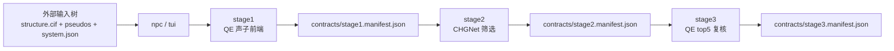

# Nonlinear Phonon Calculation

[English](README.md) | [中文](README_zh.md)

这个仓库把分阶段工作流收口到一个对操作者可见的入口：`npc`。

整个仓库围绕三个边界组织：

1. 代码树
2. 外部输入树
3. 运行时自动生成的运行树

如果你要看当前真实调用链和目录职责，直接看
[ARCHITECTURE.md](ARCHITECTURE.md)。

使用方式应该是：

1. 在外部输入目录里准备一个体系目录
2. 运行 `npc`
3. 选择体系和阶段
4. 让程序自己生成 QE 输入、内部 contract 和运行目录

用户不应该在第一次运行之前就去理解 `stage1.manifest.json` 或
`stage2.manifest.json`。这些文件仍然存在，但它们属于运行时内部交接，不再是用户主界面的一部分。

## 仓库结构

### 1. 代码树

当前这个仓库就是代码树。它只放：

- 工作流代码
- TUI 启动器
- 文档
- 输入样例
- 可复用的算法模块

它不应该再夹带用户真实 CIF、用户真实赝势、或历史运行目录。

### 2. 外部输入树

用户输入放在代码树之外，例如：

```text
<input_root>/
  wse2/
    structure.cif
    system.json
    pseudos/
      W.pz-spn-rrkjus_psl.1.0.0.UPF
      Se.pz-n-rrkjus_psl.0.2.UPF
```

每个体系目录都是自洽的。

### 3. 运行树

每次运行都会在 runs 根目录下生成自己的运行树，例如：

```text
.../Nonlinear-Phonon-Calculation-runs/
  wse2/
    wse2_20260331_235959/
      contracts/
      logs/
      stage1/
      stage2/
      stage3/
```

内部 contract 和阶段输出都放在这里，不再和用户输入混在一起。

## Quick Start

### 先准备一个体系目录

直接参考自带的 WSe2 输入样例：

- [examples/wse2_input_example/README_zh.md](examples/wse2_input_example/README_zh.md)

一个体系目录至少需要：

- `structure.cif`
- `system.json`
- `pseudos/*.UPF`

### 启动 TUI

在仓库根目录执行：

```bash
./install.sh
./npc --input-root /path/to/Nonlinear-Phonon-Calculation-inputs --system wse2
```

如果你的用户安装目录已经在 `PATH` 里，也可以直接用：

```bash
npc --input-root /path/to/Nonlinear-Phonon-Calculation-inputs --system wse2
```

兼容入口也可以：

```bash
./tui --input-root /path/to/Nonlinear-Phonon-Calculation-inputs --system wse2
python3 start_release.py --input-root /path/to/Nonlinear-Phonon-Calculation-inputs --system wse2
```

### 常见分阶段命令

只跑 stage1：

```bash
python3 start_release.py \
  --input-root /path/to/Nonlinear-Phonon-Calculation-inputs \
  --system wse2 \
  --stage stage1 \
  --qe-relax yes
```

继续最新一次 run 的 stage2：

```bash
python3 start_release.py \
  --input-root /path/to/Nonlinear-Phonon-Calculation-inputs \
  --system wse2 \
  --stage stage2
```

继续最新一次 run 的 stage3：

```bash
./npc \
  --input-root /path/to/Nonlinear-Phonon-Calculation-inputs \
  --system wse2 \
  --stage stage3
```

只做 QE top-5 复核的 prepare，不立即提交任务：

```bash
./npc \
  --input-root /path/to/Nonlinear-Phonon-Calculation-inputs \
  --system wse2 \
  --stage stage3 \
  --qe-mode prepare_only
```

之后在同一个 run root 上继续 stage3：

```bash
./npc \
  --run-root /path/to/run_root \
  --stage stage3 \
  --qe-mode submit_collect
```

如果没有显式给 `--run-root`，启动器会自动选择这个体系最新的一次运行目录。

只读查看当前状态：

```bash
./npc --status
```

查看某个体系或某个 run root 的状态：

```bash
./npc --input-root /path/to/Nonlinear-Phonon-Calculation-inputs --system wse2 --status
./npc --run-root /path/to/Nonlinear-Phonon-Calculation-runs/wse2/wse2_20260331_235959 --status
```

在 stage1 或 stage2 之后导出跨机器 handoff 包：

```bash
./npc --handoff-export stage1 --run-root /path/to/run_root --output /tmp/wse2_stage1_handoff.tar.gz
./npc --handoff-export stage2 --run-root /path/to/run_root --output /tmp/wse2_stage2_handoff.tar.gz
```

在另一台机器导入 handoff 包：

```bash
./npc --handoff-import --bundle /tmp/wse2_stage1_handoff.tar.gz --run-root /path/to/new_run_root
```

做收敛性测试：

```bash
python3 start_release.py \
  --input-root /path/to/Nonlinear-Phonon-Calculation-inputs \
  --system wse2 \
  --stage tune \
  --qe-relax no
```

## 工作流模型



### Stage 1

`stage1` 现在从 `structure.cif` 开始，而不是从包内部藏着的 `scf.inp` 开始。

stage1 当前路径是：

1. 读取 `structure.cif`、`system.json` 和 `pseudos/`
2. 在运行树里自动生成内部 QE 输入
3. 可选执行 QE relax
4. 跑声子前端
5. 提取 screened eigenvectors
6. 生成 `mode_pairs.selected.json`
7. 写 `contracts/stage1.manifest.json`

### Tuning

`tune` 是一个由 TUI 驱动的收敛性测试阶段。

它会根据 `system.json` 里的 `workflow_family` 选择对应的参数扫描配置，
把筛出来的 profile 写进 stage1 runtime bundle，再由
`qe_phonon_stage1_server_bundle/step1_frontend.py` 自动读取。

### Stage 2

`stage2` 从选中的运行目录里读取 `contracts/stage1.manifest.json`，然后输出 CHGNet ranking 和 `contracts/stage2.manifest.json`。

### Stage 3

`stage3` 从 `contracts/stage2.manifest.json` 继续，准备 QE top-5 复核任务，并在 prepare 完成后立刻写 `contracts/stage3.manifest.json`。

如果 `stage3/qe/<backend>/run_manifest.json` 已经存在，重新执行 `npc`
会直接复用已有 prepare 结果，不会重复生成 QE 输入；如果
`results/qe_ranking.json` 已存在且 submission 已全部完成，则会直接识别为完成态并复用最终结果。

`npc --status` 现在会直接打印：

- QE run root
- 已准备 job 数
- completed / total / active 进度
- 最终 QE 状态
- resume mode
- top QE ranking 行

也就是说，正常监控不再要求用户自己去翻 `submission_log.json` 或 `qe_ranking.json`。

## 跨机器 handoff

跨机器接力现在是显式用户命令，而不是默认靠人工复制目录。

推荐的真实机器拆分是：

1. 在可以稳定运行 QE 声子前端的机器上跑 `stage1`
2. 导出 `stage1` handoff bundle
3. 在适合 `stage2/3` 的机器上导入这个 bundle
4. 跑 `stage2`
5. 视情况导出 `stage2` handoff bundle，或直接原地继续
6. 跑 `stage3`

handoff 包继续保持一个核心约束：manifest 内路径全部相对于导入后的 run root。

## 软件环境要求

这个包刻意不绑定任何站点内部环境名。真正需要被满足的是可执行程序和
Python 模块接口，而不是某个特定的 Conda 环境名称。

### 基础要求

- `python3`
- `python3 -m pip`
- 成功执行过一次 `./install.sh`
- 用于 clone / update 的 `git`

### 分阶段运行时要求

- `stage1`
  - `PATH` 中可直接调用的 Quantum ESPRESSO 可执行程序：
    - `pw.x`
    - `ph.x`
    - `q2r.x`
    - `matdyn.x`
  - 一套能够稳定运行 QE 声子前端的调度/运行时组合
- `stage2`
  - 当前 Python 解释器里可导入的模块：
    - `chgnet`
    - `torch`
    - `phonopy`
    - `pymatgen`
- `stage3`
  - `PATH` 中可直接调用的 Quantum ESPRESSO 可执行程序
  - 若使用 `submit_collect`，还需要机器具备适合 QE 批量提交的调度/运行环境

### 基于当前验证结果的操作建议

- `stage1` 对 QE 声子前端稳定性最敏感。在现有验证里，最稳妥的做法是把
  `stage1` 放到一台已经确认能稳定执行 `ph.x` 的机器上。
- `stage2` 的核心依赖是 Python 材料模拟栈；一旦 `stage1` contract 自洽，
  它通常比 `stage1` 更容易迁移。
- `stage3` 可以分成两种模式：
  - `--qe-mode prepare_only`：只生成 QE top-5 复核批次，不提交作业
  - `--qe-mode submit_collect`：在具备调度器的机器上提交并监控 QE 作业

### 环境激活说明

本文档中的命令默认假设：当你执行 `npc` 时，所需的可执行程序和 Python
模块已经在当前 shell 中可用。如果你所在机器依赖 Conda、module system
或站点初始化脚本，请先完成环境激活，再执行这里的命令。本仓库不预设任何
特定的激活命令，也不预设任何特定环境名。

## 输入文件要求

每个体系目录必须包含：

- `structure.cif`
- `system.json`
- `pseudos/*.UPF`

当前 `system.json` 结构刻意保持很小：

```json
{
  "system_id": "wse2",
  "formula": "WSe2",
  "workflow_family": "tmd_monolayer_hex",
  "preferred_pseudos": {
    "W": "W.pz-spn-rrkjus_psl.1.0.0.UPF",
    "Se": "Se.pz-n-rrkjus_psl.0.2.UPF"
  },
  "already_relaxed": false,
  "notes": "可选备注"
}
```

## 目录怎么读

- `nonlinear_phonon_calculation/`
  - CLI 入口和输入发现逻辑
- `server_highthroughput_workflow/`
  - 阶段编排、运行时准备、manifest，以及 stage2/3 helper
- `qe_phonon_stage1_server_bundle/`
  - stage1 真实声子前端，以及收敛性测试
- `qe_modepair_handoff_workflow/`
  - stage3 的 QE 准备与回收
- `mlff_modepair_workflow/`
  - stage2 的 CHGNet 筛选
- `examples/wse2_input_example/`
  - 用户可见输入样例

## 当前范围

这个仓库不会假装“跨机交接已经消失”。它做的是把交接收进运行树里，并让 `npc` 来负责主流程。
