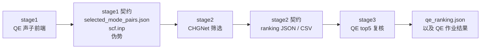
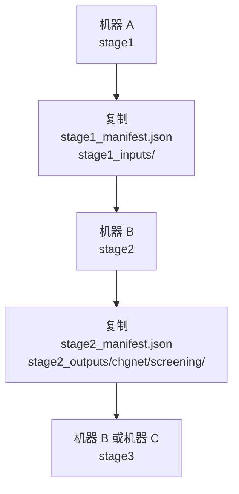

# Nonlinear Phonon Calculation

[English](README.md) | [中文](README_zh.md)

这是一个按阶段组织的非线性声子工作流包，目标是把“真实声子前端、机器学习筛选、QE 复核”拆开，并且让每一段都能单独运行、单独交接、单独续算。

这套包默认面向两台机器协作的场景：

- `stage1` 在更适合跑声子前端的老机器上完成
- `stage2` 和 `stage3` 在更适合筛选和批量单点计算的新机器上完成

它不是一个把所有历史结果都塞进去的归档包，而是一个可以真正拿去运行、拿去交接、拿去继续维护的稳定版。

## Quick Start

### 1. 安装

在 bundle 根目录执行：

```bash
./install.sh
```

如果你是在做打包验证，可以用：

```bash
NPC_INSTALL_MODE=wheel ./install.sh
```

安装后推荐直接使用：

```bash
npc
```

兼容入口仍保留：

```bash
./tui
python3 start_release.py
```

### 2. 推荐机器分工

- `stage1`：适合 QE 声子前端的 Slurm 机器
- `stage2/3`：适合 CHGNet 筛选和 QE 批量任务的机器

这个分工不是随便定的。

- `stage1` 是最重的声子前端，适合放在 `pw.x / ph.x / q2r.x / matdyn.x` 跑得稳定的 Slurm 机器上
- `stage2` 是 CHGNet 筛选，适合放在 CPU 吞吐稳定、线程可控的机器上
- `stage3` 是大量独立的 QE 单点复核任务，也更适合和 stage1 分开管理

包内不会自动帮你 SSH 传文件。跨机接力靠 `release_run/` 里的契约文件完成。

### 3. 一条真实可用的跑法

先在 `stage1` 机器上：

```bash
npc
```

交互里选择：

- `Run QE structure relaxation first?` -> `yes`
- `Which stage to run?` -> `stage1`

完成后会得到：

- `release_run/stage1_manifest.json`
- `release_run/stage1_inputs/`

把这两个内容复制到 `stage2/3` 机器后，继续执行：

```bash
python3 server_highthroughput_workflow/run_modular_pipeline.py \
  --stage stage2 \
  --run-root /path/to/release_run \
  --runtime-profile medium
```

再继续：

```bash
python3 server_highthroughput_workflow/run_modular_pipeline.py \
  --stage stage3 \
  --run-root /path/to/release_run \
  --qe-mode submit_collect
```

如果你此时只想确认 stage3 的 QE 批任务是否准备正确，而不想真的提交整批计算：

```bash
python3 server_highthroughput_workflow/run_modular_pipeline.py \
  --stage stage3 \
  --run-root /path/to/release_run \
  --qe-mode prepare_only
```

## 这套包到底在做什么

整个包分三层，不是因为“看起来整齐”，而是因为这三层本来就是三类完全不同的计算。



### Stage 1

`stage1` 是真实的声子前端。它从 `scf.inp` 出发，跑完 QE 的声子链，再生成后续筛选需要的 mode pair 输入。

默认流程是：

1. 可选 `vc-relax`
2. 筛出这套工作流实际要用的 q 点
3. 跑 `pw.x -> ph.x -> q2r.x -> matdyn.x`
4. 提取本征矢量和频率
5. 选择候选 mode pair
6. 打包 handoff 文件

当前稳定版使用的声子参数，是前面收敛性测试收出来的 `phonon.balanced`：

- `ecutwfc = 100`
- `ecutrho = 1000`
- `primitive_k_mesh = 12x12x1`
- `conv_thr = 1.0d-10`
- `degauss = 1.0d-10`
- `q-grid = 6x6x1`

### Stage 2

`stage2` 读取 `stage1` 的契约文件，使用 CHGNet 对 mode pair 做排序筛选。

它不依赖 stage1 的完整运行目录，只需要：

- `stage1_manifest.json`
- `stage1_inputs/`

默认筛选策略是：

- `strategy = coarse_to_fine`
- `coarse_grid_size = 5`
- `full_grid_size = 9`
- `refine_top_k = 24`
- `batch_size = 16`
- `num_workers = 2`
- `torch_threads = 16`

输出是 CSV 和 JSON 两套 ranking。

### Stage 3

`stage3` 读取 `stage2_manifest.json`，自动选出 top 5，生成 QE 复核目录，并可直接提交批量复核作业。

当前默认是：

- `top_n = 5`
- QE preset `pes_fast`

现在的 `stage3_manifest.json` 会在 QE 批任务准备好之后立即写出，不再等整批收尾才落盘。

## 契约文件怎么交接

这套包的核心设计是：每个阶段都把“下一阶段真正需要的最小输入”写成清晰文件，而不是让后续阶段偷偷依赖整台机器的运行上下文。

### Stage 1 -> Stage 2

必须复制：

- `release_run/stage1_manifest.json`
- `release_run/stage1_inputs/structure/scf.inp`
- `release_run/stage1_inputs/pseudos/*.UPF`
- `release_run/stage1_inputs/mode_pairs/selected_mode_pairs.json`

### Stage 2 -> Stage 3

必须复制：

- `release_run/stage2_manifest.json`
- `release_run/stage2_outputs/chgnet/screening/pair_ranking.csv`
- `release_run/stage2_outputs/chgnet/screening/pair_ranking.json`
- `release_run/stage2_outputs/chgnet/screening/single_backend_ranking.json`

这就是为什么这套包适合跨机器断点续算。



## 常用命令

### 交互式入口

```bash
npc
```

这是默认入口，适合第一次上手或需要交互确认阶段的人。

### 显式分阶段运行

在 bundle 根目录执行：

```bash
python3 server_highthroughput_workflow/run_modular_pipeline.py --stage stage1 --run-root /path/to/release_run
python3 server_highthroughput_workflow/run_modular_pipeline.py --stage stage2 --run-root /path/to/release_run --runtime-profile medium
python3 server_highthroughput_workflow/run_modular_pipeline.py --stage stage3 --run-root /path/to/release_run --qe-mode prepare_only
```

最常用的参数：

- `--runtime-profile small|medium|large|default`
- `--runtime-config /path/to/runtime.json`
- `--scheduler auto|slurm|local`
- `--qe-mode prepare_only|submit_collect`
- `--top-n 5`

## 目录结构怎么读

最重要的目录是：

- `qe_phonon_stage1_server_bundle/`
  - 真实 `stage1` 运行时
- `server_highthroughput_workflow/`
  - `stage2` 和 `stage3` 的编排入口
- `qe_modepair_handoff_workflow/`
  - QE 批任务的准备、提交、回收
- `examples/wse2/`
  - WSe2 契约样例
- `nonlocal phonon/`
  - 默认结构和伪势

## WSe2 Example

`examples/wse2/` 是稳定版自带的参考样例。

它包含：

- 最小 `scf.inp`
- 伪势文件
- 小型 `stage1_manifest.json`
- 小型 `stage2_manifest.json`
- 一组小型 ranking 输出

它的作用是：

- 让你看清 handoff 文件长什么样
- 让你知道 stage2/stage3 实际期待读取什么
- 让你能把样例输入替换成自己的真实运行结果

它不是完整生产计算结果，也不是把所有历史输出都塞进稳定版。

参见：

- [examples/wse2/README.md](examples/wse2/README.md)
- [examples/wse2/README_zh.md](examples/wse2/README_zh.md)

## 运行上的几个现实说明

- `stage1` 默认放在老机器，是因为目前 `ph.x` 在那边更稳定。
- `stage2` 和 `stage3` 默认只依赖契约文件，不依赖上游机器的完整运行目录。
- 稳定版已经去掉黄金参考数据，不再把它当作运行时刚需。
- 稳定版也不再携带本地缓存、历史 benchmark 目录和旧的 `release_run`。

## 继续往下看

- stage1 说明：
  - [qe_phonon_stage1_server_bundle/README.md](qe_phonon_stage1_server_bundle/README.md)
  - [qe_phonon_stage1_server_bundle/README_zh.md](qe_phonon_stage1_server_bundle/README_zh.md)
- stage2/stage3 说明：
  - [server_highthroughput_workflow/README.md](server_highthroughput_workflow/README.md)
  - [server_highthroughput_workflow/README_zh.md](server_highthroughput_workflow/README_zh.md)
