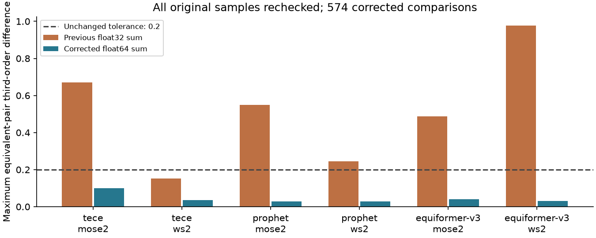
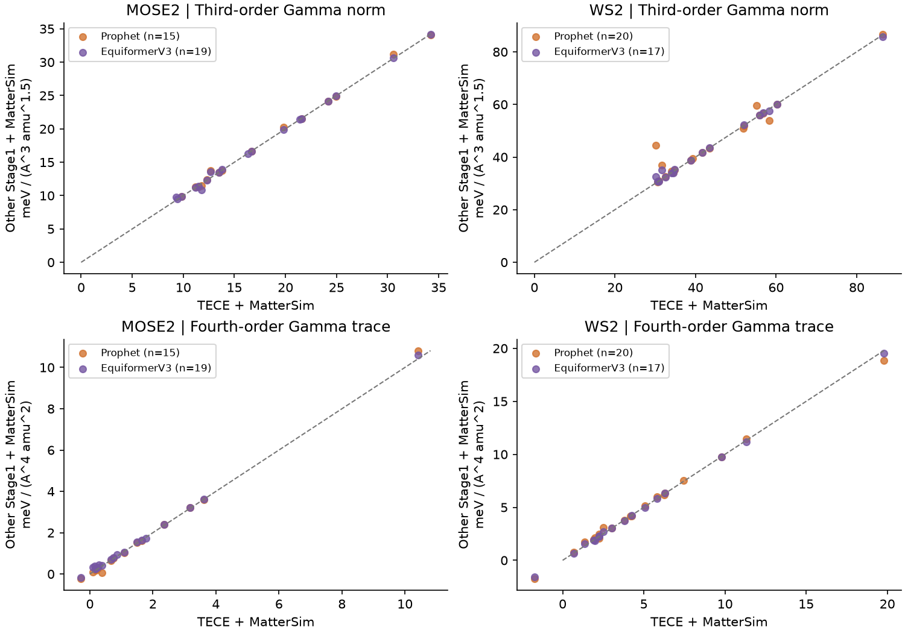
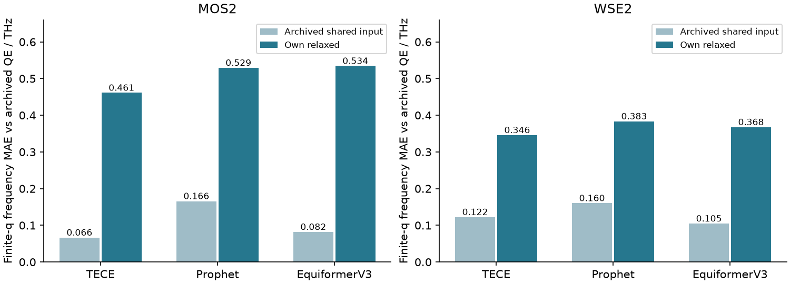

# 六方二维声子筛选：1.0.1 补充验收与完整对照

本报告修正初版验收范围不足的问题。正式方案保持三条路线：**Phonopy＋TECE／Prophet／EquiformerV3 Stage1，各接 MatterSim Stage2**；每模型只用自行弛豫结构，Γ 只取光学模。MoSe₂、WS₂ 是两种验收材料，共六组实验。未新增 DFT 或 MD。

研究的主要科学对照已单独整理为[模型路线与DFT精算的定量比较](MODEL_DFT_COMPARISON.md)：按本科论文的图表框架，包含各网络路线与DFT五对的三/四阶系数、MAE/RMSE/最大误差、势能面、频率、拟合残差、其他三阶项及窗口敏感性。本文侧重软件验收；模型间一致性不代替DFT标准。

## 原计划验收清单

| 工作项 | 状态与证据 |
|---|---|
| 实际原子对称性与 q 轨道 | 已实现；60°/120°、1/2/3 原子、BN、TMD、Janus、降对称结构测试；不固定六类。 |
| Γ 及有限 q 模态协变 | 已修复漏检 Γ 的问题；每个操作及时间反演均检查，失败退回 q/−q；六组候选均保持 324 对。 |
| 实际 MLFF 等价点耦合 | 每组起始12个代表通道，覆盖全部6个q轨道及其成员；追加旧排名样本后共574/574通过，覆盖全部原522次检查。不是全部324候选的穷举。 |
| 全量六点与入选精算 | 六组均 324/324 候选完成；前20通道展开分量及简并伙伴，5×5 满秩；最强五通道 9×9。 |
| 故障恢复／分片／来源隔离 | 自动测试与1/4工作进程实算对照通过；新累加协议入检查点身份，不混用旧点。 |
| 软件稳定性与可读性 | 服务器39项测试通过；本地38通过、Torch依赖测试跳过1项；Ruff、指定入口mypy及干净wheel安装检查。 |
| 模型比较与历史DFT | 本报告及CSV提供全网格频率、模态重叠、可靠通道的三/四阶差异。 |
| CPU成本归因 | 已有同节点108原子基准及profile；见初版记录的成本章节。 |
| 历史数据边界 | 四条WSe₂历史四阶原始网格未找回；明确缺失，不以新DFT补齐。历史QE结构来源不完全独立核实。 |

## 1. 数值修正及复验

原先只测两个 M 点不足以支持全网格等价性结论。扩展检查发现旧 float32 总能量求和有明显顺序依赖。两个最差案例在相同进程中复算：三阶差约 0.671／0.977；只提升累加精度后为 0.0191／0.0143；完整 float64 诊断为约 10⁻⁸。实际修复仅将逐原子能量在最终求和前提升为 float64，保留原始 float32 模型和特征；不修改权重或安装环境。本文三阶单位为meV/(ų·amu³ᐟ²)，四阶单位为meV/(Å⁴·amu²)。

| 路线/材料 | 修正前失败/87 | 修正后失败/检查数 | 最大能量差/eV | 最大三阶差 |
|---|---:|---:|---:|---:|
| tece/mose2 | 32 | 0/89 | 5.63e-05 | 0.09894 |
| tece/ws2 | 30 | 0/89 | 2.81e-05 | 0.03481 |
| prophet/mose2 | 40 | 0/109 | 1.34e-05 | 0.02885 |
| prophet/ws2 | 32 | 0/89 | 2.15e-05 | 0.02813 |
| equiformer-v3/mose2 | 38 | 0/99 | 2.77e-05 | 0.04005 |
| equiformer-v3/ws2 | 40 | 0/99 | 2.62e-05 | 0.03147 |

预设容差始终为 10⁻⁴ eV 和三阶 0.2，未调宽。上述检查比较同一模型结构上的对称等价位移，不要求跨模型的位移完全重合。
数值修正改变了部分近零通道的先后顺序；复验既覆盖新排序选样，也补回了全部旧样本，避免用换样本掩盖失败。生产前20通道仅MoSe₂/TECE改变一项：line_p2_m8__Gamma_6替代M_p6_m9__Gamma_7_8，分量精算由24对变23对。其余五组入选通道集合不变。

独立1与4工作进程比较 1944 个点，最大能量差 0 eV，最大三阶代理差 0。新数值运行目录为服务器 `runs-accepted`，旧 `runs-final` 完整保留。Stage1 沿用已算力常数和模态，仅用修正后的算法重新核验并生成来源可追溯的候选，没有重复弛豫。

Γ 双重态指两个零动量偏振。排名是各分量 Γ–q–(−q) 三阶系数的向量范数，不是 Γ₁–Γ₂–q 的三声子系数。有限 q 下 Φ112 对应 QΓ²Qq，受动量守恒禁止；保留为数值／拟合误差诊断，绝不用于排名。动量允许不代表点群一定允许。

在修正前后都完成精算的相同通道上，四阶迹的模型间MAE也减小，说明原先部分模型差异实际混有总能量累加误差。这仍然不是对DFT准确性的证明。

| 材料/模型比较 | 相同通道数 | 修正前四阶迹MAE | 修正后四阶迹MAE |
|---|---:|---:|---:|
| mose2_tece_vs_prophet | 15 | 0.599 | 0.072 |
| mose2_tece_vs_equiformer-v3 | 18 | 0.593 | 0.080 |
| mose2_prophet_vs_equiformer-v3 | 17 | 0.280 | 0.081 |
| ws2_tece_vs_prophet | 20 | 0.449 | 0.156 |
| ws2_tece_vs_equiformer-v3 | 17 | 0.436 | 0.083 |
| ws2_prophet_vs_equiformer-v3 | 17 | 0.188 | 0.162 |

## 2. 新材料完整性和计算量

| Stage1/材料 | 六点候选 | 精算模式对 | 9×9模式对 | 独立能量点 | 累计推理秒 |
|---|---:|---:|---:|---:|---:|
| tece/mose2 | 324/324 | 23 | 5 | 2661 | 270.7 |
| tece/ws2 | 324/324 | 24 | 5 | 2680 | 259.6 |
| prophet/mose2 | 324/324 | 24 | 5 | 2680 | 263.8 |
| prophet/ws2 | 324/324 | 24 | 5 | 2680 | 256.6 |
| equiformer-v3/mose2 | 324/324 | 24 | 5 | 2680 | 270.7 |
| equiformer-v3/ws2 | 324/324 | 26 | 5 | 2718 | 261.4 |

所有中心拟合均为13列满秩，来源哈希、点数、有限值及唯一性均已核对。累计推理秒是各进程工作量之和，不是作业墙钟。作业采用CPU、每任务16 CPU与4×4线程分片，数组最多同时3项；加独立验证任务也低于十节点上限。

## 3. 三条路线的可靠逐通道比较

以本征矢重叠及近简并子空间建立映射。排除有限 q 简并单支、Γ多重态不能完整匹配及重叠不足的通道。三阶比较完整 Γ 向量范数；四阶比较完整 Γ 的 Φ1122 对角迹，不能用对角元素范数代替旋转不变量。有限窗口拟合仍受高阶项影响。下表是模型间差异，不是 DFT 误差。

| 材料/比较 | 共同精算通道 | 三阶 MAE / RMSE | 四阶迹 MAE / RMSE |
|---|---:|---:|---:|
| mose2_tece_vs_prophet | 15 | 0.209 / 0.345 | 0.072 / 0.133 |
| mose2_tece_vs_equiformer-v3 | 19 | 0.164 / 0.317 | 0.084 / 0.107 |
| mose2_prophet_vs_equiformer-v3 | 17 | 0.167 / 0.235 | 0.081 / 0.129 |
| ws2_tece_vs_prophet | 20 | 1.605 / 3.691 | 0.156 / 0.270 |
| ws2_tece_vs_equiformer-v3 | 17 | 0.540 / 1.040 | 0.083 / 0.114 |
| ws2_prophet_vs_equiformer-v3 | 17 | 1.222 / 3.072 | 0.162 / 0.233 |

三阶单位：meV/(ų·amu³ᐟ²)；四阶单位：meV/(Å⁴·amu²)。

WS₂ 的 M 第6支与 Γ 第6/7光学双重态是值得保留的反例：旧总能量结果下 TECE、Prophet 路线三阶范数分别为30.116、44.369，虽然有限 q 模重叠平方为0.98487。交叉诊断给出“TECE结构＋Prophet模式”44.316、“Prophet结构＋TECE模式”30.148。这里约47%的差异主要随模式方向变化，几何交换仅改变约0.03–0.05。该诊断只解释模型间差异，不说明哪个更接近DFT；正式生产没有增加共用结构路线。

## 4. 历史QE全网格对照：明确区分结构线

共读取两材料×两条历史结构线×三模型×36q×9支＝3888条模式记录。主流程采用自行弛豫；共用结构仅作离线历史参照。这里的WSe₂全网格参照来自早期65/650 Ry、12×12原始QE矩阵的6×6子集，恢复本征矢时采用dynmat asr='no'。该导出的Γ三条声学频率为−0.441611、0.493963、0.518132 THz，不能与已施加ASR的MLFF Γ声学支直接评分；因此下表统一使用35个有限q点。此限制不等于后来的80/800 Ry关键模式及耦合复核存在ASR错误。完整CSV保留Γ数据；结构来源未完全核实，以下仍为历史参照差异。见[WSe₂数据版本与ASR核查](WSE2_ASR_PROVENANCE.md)。

| 材料/模型 | 自弛豫频率 MAE / RMSE THz | 历史共用结构 MAE THz | 自弛豫孤立模重叠中位数 |
|---|---:|---:|---:|
| mos2/tece | 0.4611 / 0.5128 | 0.0663 | 0.999181 |
| mos2/prophet | 0.5291 / 0.6034 | 0.1658 | 0.997778 |
| mos2/equiformer-v3 | 0.5343 / 0.5931 | 0.0818 | 0.997492 |
| wse2/tece | 0.3457 / 0.3725 | 0.1224 | 0.999406 |
| wse2/prophet | 0.3833 / 0.4152 | 0.1601 | 0.997165 |
| wse2/equiformer-v3 | 0.3675 / 0.4024 | 0.1046 | 0.997902 |

自弛豫便于高通量，但“候选排名相近”不等于“频率及耦合数值相同”。本数据中自弛豫相对历史 QE 的频率差明显增大，应作为结构敏感性记录，不能套用共用结构下更好的误差数字。

## 5. DFT精算五对：三阶及四阶

逐对从旧本征矢恢复实际质量归一化实位移，能量显式按Ry转换。MoS₂五条、WSe₂一条原始网格可重拟合；WSe₂其余四条只保留归档三阶幅值，四阶留空。K类旧坐标的实模范数约1/√2，实际拟合采样窗口不同；四阶的窗口差异尤其需要保留。下表只列当前采用的自弛豫结构方向对照，完整CSV另含历史共用结构。
下表MLFF数值使用总能量累加修正后的30对专项复算。DFT标签保持已有五对；完整误差、论文原QE＋MatterSim基线及图示分析见上述科学对照报告。

| 材料/旧QE方向 | QE 三阶 / 四阶 | TECE＋MS | Prophet＋MS | Equiformer＋MS |
|---|---:|---:|---:|---:|
| mos2/M_q_0.500_0.000_0.000_m9 | 106.134 / 8.453 | 88.877 / 13.512 | 89.423 / 13.607 | 88.725 / 13.350 |
| mos2/M_q_0.500_0.000_0.000_m8 | 98.766 / 8.554 | 83.037 / 7.574 | 84.147 / 7.392 | 83.419 / 7.559 |
| mos2/M_q_0.500_0.000_0.000_m7 | 78.023 / 9.814 | 69.113 / 11.731 | 68.832 / 11.704 | 69.210 / 11.748 |
| mos2/K_q_0.333_0.333_0.000_m9 | 74.299 / 4.190 | 58.545 / 6.953 | 58.544 / 6.982 | 58.552 / 6.799 |
| mos2/line_q_0.333_0.667_0.000_m8 | 67.776 / 1.641 | 62.731 / 3.076 | 62.782 / 3.062 | 63.064 / 3.066 |
| wse2/M_q_0.500_0.000_0.000_m9 | 30.581 / 1.904 | 26.152 / 3.193 | 26.137 / 3.133 | 25.945 / 3.129 |
| wse2/M_q_0.500_0.000_0.000_m8 | 27.768 / 缺失 | 22.667 / 1.278 | 23.002 / 1.317 | 22.768 / 1.262 |
| wse2/M_q_0.500_0.000_0.000_m7 | 22.479 / 缺失 | 18.433 / 1.666 | 18.429 / 1.684 | 18.389 / 1.639 |
| wse2/K_q_0.333_0.333_0.000_m9 | 21.192 / 缺失 | 17.675 / 1.519 | 17.674 / 1.510 | 17.676 / 1.492 |
| wse2/line_q_0.333_0.667_0.000_m8 | 19.853 / 缺失 | 17.265 / 1.560 | 17.262 / 1.561 | 17.195 / 1.540 |

每格依次为三阶幅值／四阶Φ1122。这里比较同一高重叠声子方向的最终耦合，不比较未经对齐的绝对总能量，也不把不同结构／模态基底硬称为同一DFT势能面。有限q简并分量依旧标记基底相关。

## 6. 粗筛选择与物理限制

保留默认“所有候选六点＋前20完整通道5×5＋最强五通道9×9”。历史MoS₂/WSe₂六组自弛豫9×9数据回放中，筛20对中心精算前20的召回为19/20或20/20；筛30均为20/20。提高召回可设 `--top-channels 30`，但小样本不保证任意材料的召回。六点不能给出可靠四阶系数。

在相同108原子、16线程节点基准中，Prophet热推理约2.862s，TECE约1.871s；profile指向模型与力求导，而非适配器或邻居表准备，是主要差别。分级筛选后Stage1与Stage2处于同一时间量级。对WS₂最强通道，四阶系数从中心5×5到9×9仍有明显变化，软件验收通过不代表四阶物理收敛。Phonopy平移ASR也不等于二维ZA转动求和规则已满足。

## 数据与复现

- [汇总、来源哈希与修正诊断](acceptance_v5_1.json)
- [逐通道与逐模式CSV目录](acceptance_data/)
- [历史DFT重拟合及来源](acceptance_data/archived_dft_comparison.json)
- [初版基准与归档回放记录](VALIDATION.md)

离线脚本位于 `validation/compare_relaxed_campaign.py`、`compare_archived_dft.py` 和 `build_acceptance_report.py`，不包含Stage3输入生成或作业提交。机器相关路径通过参数传入。39项测试包含解析势、动量诊断、Γ协变退回、相位／简并子空间、检查点和浮点求和梯度回归。

服务器证据根目录：`/home/lmtsakura/qiyan_shared/testing/hex-phonopy-stable`。正式重算及首轮等价性：1019600；不同分片复验：1019605；最终源码测试：1019608／1019615；补齐原等价性样本：1019609。数值重算源码快照为code-acceptance，最终接口测试快照为code-verify；计算结果及所有旧文件保留。
