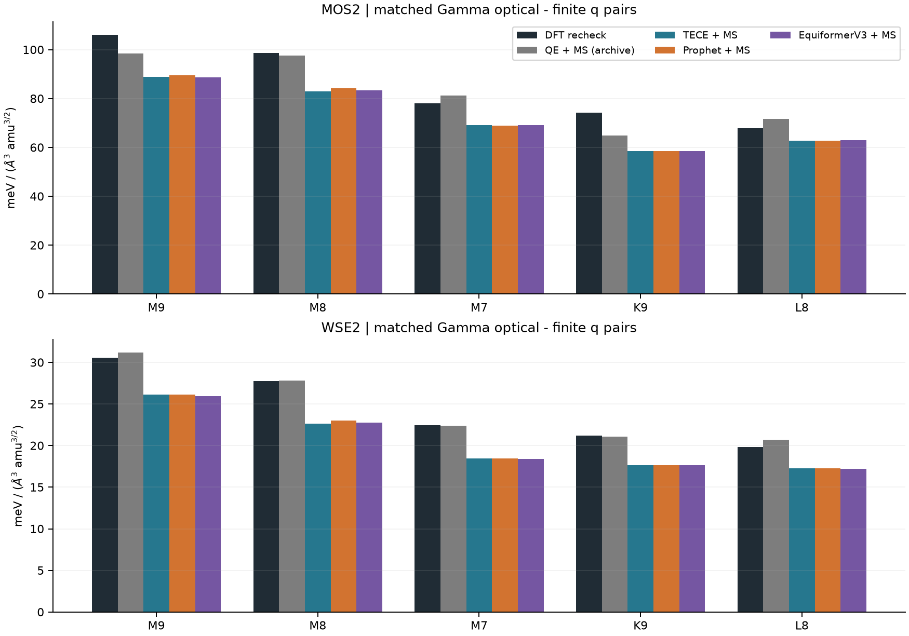
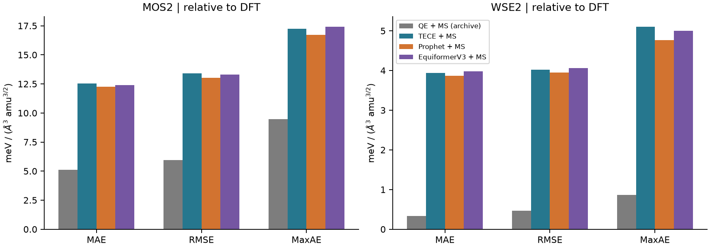
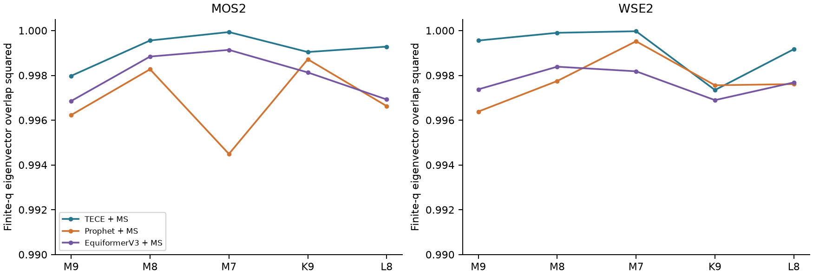
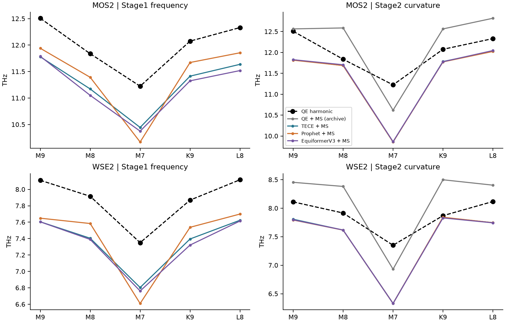
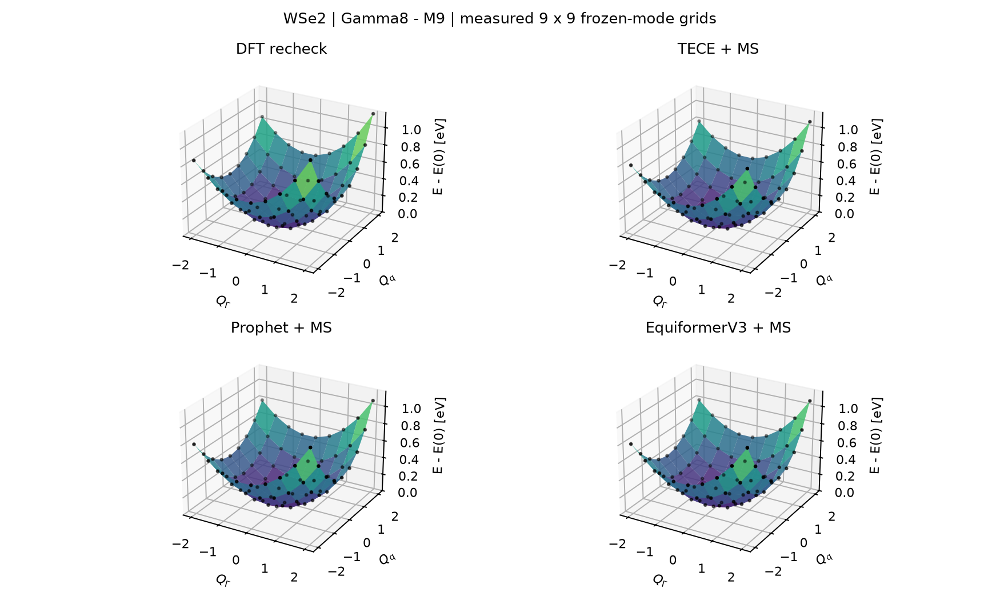
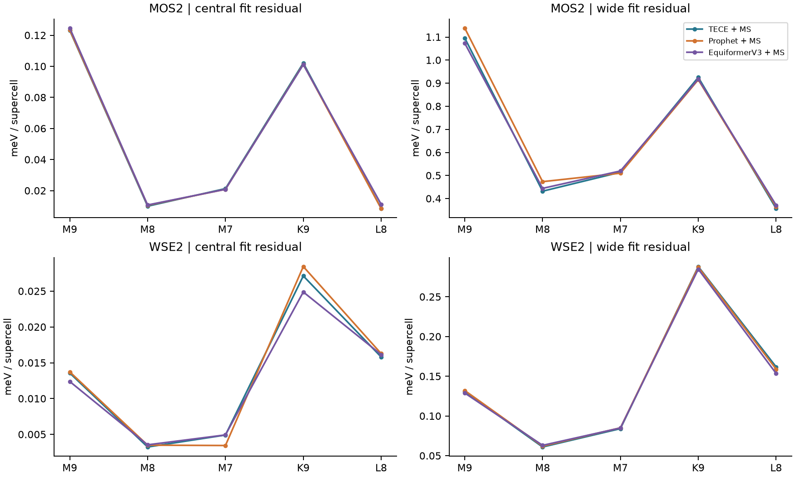
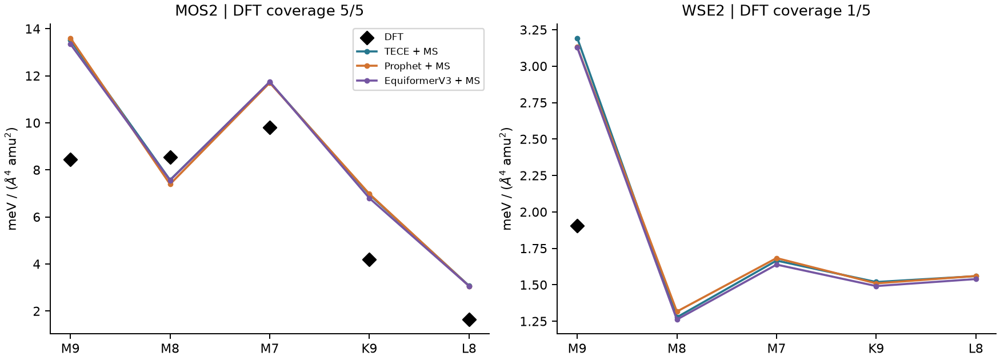
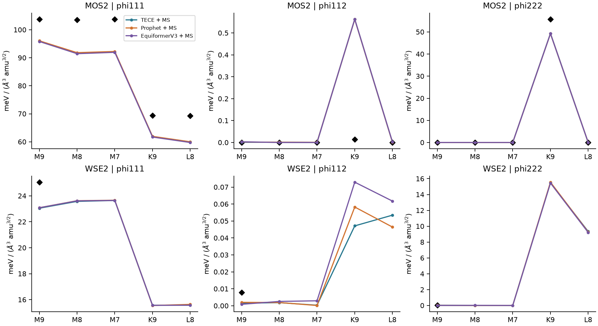
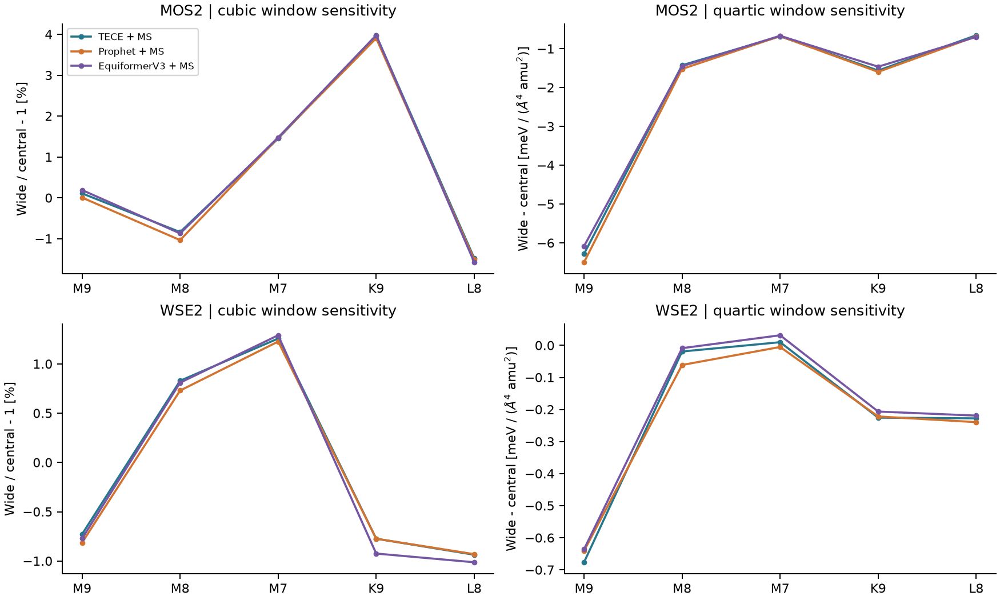
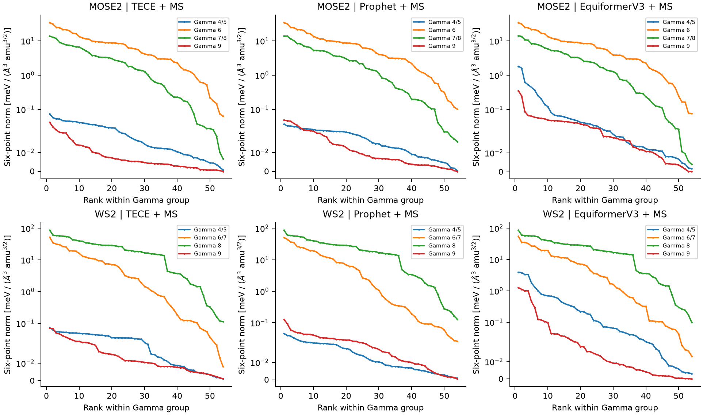

# 模型路线与 DFT 精算的定量比较

> **历史 PZ-LDA 对照。**
> 当前三材料 GGA-PBE 数据和图表见 [PBE 参考报告](PBE_REFERENCE.md)。下文系数不是当前 PBE 标签。

本报告按本科论文第3、4章的比较顺序组织：同一声子对的耦合、误差、势能面、频率、拟合残差和其余展开项。科学参照是已有QE精算五对；TECE、Prophet、EquiformerV3各自弛豫并生成Phonopy模式，Stage2均为MatterSim。另列论文原有QE模式＋MatterSim历史基线。

论文比较的重点是固定DFT结构和模式后的不同Stage2力场；本轮比较的重点则是换成MLFF自行弛豫及生成模式后的完整两阶段路线。因此既要看筛选顺序是否保留，也要检验绝对耦合和二阶曲率是否偏离DFT。GPTFF不再进入现行路线比较。

主要结果：三条全MLFF路线在MoS₂五对上的三阶平均相对误差约14.2–14.5%，WSe₂约15.9–16.3%；论文式QE＋MatterSim历史基线分别约6.25%和1.45%。三条新路线的三阶均系统性偏低，路线间差别远小于它们共同相对DFT的偏差。筛选顺序较稳定不等于绝对耦合已达到论文原方案精度。

## 1. 相同五对的三阶耦合：DFT 是参照标准

这五对是此前筛选后经过DFT复核的固定集合，不代表已穷举得到DFT全候选前五。各材料均为Γ8与M9、M8、M7、K9、L8的对应方向，L=(1/3,2/3,0)；编号沿用QE参照，MLFF编号按本征矢匹配，不要求编号相同。

所有三阶数值均为 |Φ122|，单位 meV/(ų·amu³ᐟ²)；四阶为 Φ1122，单位 meV/(Å⁴·amu²)。多项式E含c12 QΓ Qq²与c22 QΓ²Qq²时，Φ122=2×1000c12，Φ1122=4×1000c22。非自共轭旧实模的范数约1/√2，因此K/L的旧三阶数值换到单位范数坐标后约乘2；这不是耦合物理增强。原始数值与转换因子随JSON保留。

| 材料／路线 | MAE | RMSE | 最大绝对误差 | 平均相对误差 | 五对内部Spearman |
|---|---:|---:|---:|---:|---:|
| mos2/qe-ms | 5.112 | 5.950 | 9.462 | 6.25% | 0.90 |
| mos2/tece | 12.539 | 13.403 | 17.257 | 14.45% | 0.90 |
| mos2/prophet | 12.254 | 13.043 | 16.711 | 14.18% | 0.90 |
| mos2/equiformer-v3 | 12.406 | 13.315 | 17.409 | 14.28% | 0.90 |
| wse2/qe-ms | 0.335 | 0.470 | 0.864 | 1.45% | 1.00 |
| wse2/tece | 3.936 | 4.027 | 5.101 | 16.10% | 1.00 |
| wse2/prophet | 3.874 | 3.949 | 4.765 | 15.87% | 1.00 |
| wse2/equiformer-v3 | 3.980 | 4.066 | 5.000 | 16.27% | 1.00 |

MAE/RMSE衡量最终耦合相对DFT的差异，拟合残差另列，二者不能互相代替。模型结构和模态均自行生成，因此误差包含几何、模态、势能预测及有限拟合窗口的共同影响。此处按用户要求比较匹配后的最终物理量，不要求跨模型位移逐点相同。

MoS₂各路线在五对内部的Spearman为0.90：最强三对顺序保留，K9和L8互换；WSe₂为1.00。这里的排名由换算后的|Φ122|重新排序，没有误用归档中代表原筛选顺序的rank字段。只验证过这五对，不能据此宣称DFT全候选top5召回为100%。

## 2. 逐对数值与模式对应

| 材料／声子对 | DFT | QE＋MS历史 | TECE＋MS | Prophet＋MS | EquiformerV3＋MS |
|---|---:|---:|---:|---:|---:|
| mos2/Γ8–M9 | 106.134 | 98.430 | 88.877 | 89.423 | 88.725 |
| mos2/Γ8–M8 | 98.766 | 97.682 | 83.037 | 84.147 | 83.419 |
| mos2/Γ8–M7 | 78.023 | 81.339 | 69.113 | 68.832 | 69.210 |
| mos2/Γ8–K9 | 74.299 | 64.837 | 58.545 | 58.544 | 58.552 |
| mos2/Γ8–L8 | 67.776 | 71.770 | 62.731 | 62.782 | 63.064 |
| wse2/Γ8–M9 | 30.581 | 31.162 | 26.152 | 26.137 | 25.945 |
| wse2/Γ8–M8 | 27.768 | 27.829 | 22.667 | 23.002 | 22.768 |
| wse2/Γ8–M7 | 22.479 | 22.400 | 18.433 | 18.429 | 18.389 |
| wse2/Γ8–K9 | 21.192 | 21.101 | 17.675 | 17.674 | 17.676 |
| wse2/Γ8–L8 | 19.853 | 20.717 | 17.265 | 17.262 | 17.195 |

模式映射使用质量加权复本征矢重叠，并核对q点和频率。Γ8在本集合为单模；部分有限q目标属于近简并组，CSV逐行标出组维数。这些单方向比较保留为论文式方向指标，不能据其细微差异宣布某个网络具有唯一的子空间物理优势。

这五对的有限q单模重叠平方最低为MoS₂ 0.99449、WSe₂ 0.99639，但耦合幅值仍有上述系统偏差。这说明高本征矢重叠本身不足以保证高阶耦合精度，不能把完整流程的误差只归因于本征矢。相同声子对的DFT与MLFF使用相同最小相容超胞：M为2×2、K/L为3×3；6×6是Stage1的q网格。

## 3. 二阶频率与势能面形状

左列是Stage1谐波频率；右列是Stage2势能面中心曲率。黑线均为对应QE谐波模态的频率。二者分别检验模式生成和势能预测，不能把右列与DFT的差异全部归因于Stage1。

| 材料／路线 | Stage1频率 MAE / RMSE (THz) | Stage2曲率频率 MAE / RMSE (THz) |
|---|---:|---:|
| mos2/qe-ms | 0.000 / 0.000 | 0.477 / 0.531 |
| mos2/tece | 0.706 / 0.707 | 0.559 / 0.712 |
| mos2/prophet | 0.589 / 0.636 | 0.564 / 0.715 |
| mos2/equiformer-v3 | 0.784 / 0.785 | 0.551 / 0.707 |
| wse2/qe-ms | 0.000 / 0.000 | 0.429 / 0.445 |
| wse2/tece | 0.506 / 0.507 | 0.405 / 0.521 |
| wse2/prophet | 0.457 / 0.481 | 0.407 / 0.524 |
| wse2/equiformer-v3 | 0.534 / 0.535 | 0.409 / 0.524 |

频率统计只取这五对的有限q模式，每对一个值。QE＋MS的Stage1零误差是直接使用QE模式的定义结果，不是独立预测。三条新路线的Stage2频率很接近，但本样本MoS₂有限q频率MAE仍约0.55–0.56 THz、WSe₂约0.41 THz；耦合排序保留不表示二阶曲率误差已消失。

势能面取WSe₂ Γ8–M9，沿各自匹配模式绘制9×9原始能量点，能量以各自原点为零。Γ相位按本征矢内积对齐；所有面使用相同纵轴。图可比较软硬程度、非对称性和平衡位置；这里没有把不同结构上的网格相减当作能量DFT MAE。

## 4. 拟合残差、三阶余项与四阶系数

中心残差是在[-1,1]的25点上拟合并评估；宽窗口残差是在[-2,2]的81点上拟合并评估。低拟合RMSE说明多项式能描述该模型的局部能量，不能直接证明模型接近DFT。

本次中心拟合残差为MoS₂ 0.0085–0.1246 meV/超胞、WSe₂ 0.0032–0.0284 meV/超胞，远小于对应耦合误差所表现的系统偏离；因此单纯提高多项式拟合优度不能解决相对DFT的偏差。

余项图使用幅值，避免任意模态正负号影响比较；黑色菱形为已恢复原始网格的DFT拟合值。Φ112是有限q下受动量禁止的项，非零值视为数值和拟合诊断，不能解释为新的耦合通道。

从中心5×5改到完整9×9拟合，三阶幅值最大变化为MoS₂ 3.98%、WSe₂ 1.29%；四阶Φ1122最大绝对变化却为6.50和0.68。因此四阶比三阶更依赖拟合窗口。三阶误差较小不能自动推导四阶也已收敛。

| 材料／路线 | 四阶DFT对数 | 四阶MAE | 四阶RMSE | 最大四阶误差 |
|---|---:|---:|---:|---:|
| mos2/tece | 5 | 2.431 | 2.825 | 5.058 |
| mos2/prophet | 5 | 2.484 | 2.874 | 5.154 |
| mos2/equiformer-v3 | 5 | 2.372 | 2.740 | 4.896 |
| wse2/tece | 1 | 1.289 | 1.289 | 1.289 |
| wse2/prophet | 1 | 1.228 | 1.228 | 1.228 |
| wse2/equiformer-v3 | 1 | 1.225 | 1.225 | 1.225 |

WSe₂另外四对已有DFT三阶系数，但当前收集的原始能量网格不足以恢复四阶；图中保留缺失，不填零。WSe₂的一对四阶误差只描述该对。三阶余项Φ111、Φ112、Φ222、线性项c10/c01、宽窗口三/四阶系数及原始能量均在配套CSV/JSON。有限q的Φ112按动量守恒应为零，用于数值诊断；Φ222是否允许取决于3q是否为倒格矢。

## 5. 全网格与更多材料：科学验证和软件验收分别解读

MoS₂/WSe₂已有每模型36q×9支的频率与模态记录，详见验收报告全网格表。其全网格WSe₂参照是早期未施加ASR的导出，不能与本报告关键模式/PES归档混称为同一数据源；Γ声学支不进入筛选。

MoSe₂/WS₂的六组自弛豫全量实验已完成324候选的六点筛选、前20完整通道精算及最强通道窗口检查；模型间三/四阶和效率见验收报告。这些新增材料的模型间一致性不能替代同材料的DFT精算标准。

与论文Γ分支耦合分布图对应，上图使用新增两种材料的全部六点筛选结果。每条曲线在同一Γ组内按强度排序，Γ近简并多重态合并完整分量的范数；有限q简并单支仍是基底相关方向。各图的Γ编号是该模型自己的编号，跨图的物理同一性以已保存的模态映射为准。纵轴近零区采用线性尺度、较强耦合区采用对数尺度。这些是粗筛代理值，不充当DFT精算系数。

强通道整体分布相近：MoSe₂ Γ6组最大粗筛范数为34.13–34.21，WS₂ Γ8组为86.04–87.00。但弱通道差别更明显：EquiformerV3的Γ4/5组最大值在MoSe₂/WS₂为1.83/3.93，TECE与Prophet均不超过0.074。不能只凭最强通道相近就认定三个网络全范围一致；弱通道差别也不能在没有DFT标签时直接解释为真实非线性增强。

粗筛评价同时保留成本和召回：此前六组MoS₂/WSe₂归档回放中，六点前20对中心精算前20召回为19/20或20/20，前30为20/20。这是对MLFF精算的召回，绝不称为DFT全候选召回。6点全量＋前20完整通道5×5＋强通道9×9保留为默认；用户可把前20提高到前30。

## 6. 计算成本与粗筛收益

| 材料／路线 | Stage1谐波段/s | Stage2独立点数 | Stage2累计推理/s | 相对全候选81点的点数减少 |
|---|---:|---:|---:|---:|
| tece/mose2 | 67.44 | 2661 | 270.7 | 89.86% |
| tece/ws2 | 67.45 | 2680 | 259.6 | 89.79% |
| prophet/mose2 | 99.19 | 2680 | 263.8 | 89.79% |
| prophet/ws2 | 114.15 | 2680 | 256.6 | 89.79% |
| equiformer-v3/mose2 | 47.31 | 2680 | 270.7 | 89.79% |
| equiformer-v3/ws2 | 48.69 | 2718 | 261.4 | 89.64% |

上表Stage1是程序记录的声子计算段，不含弛豫和模型加载；Stage2是所有工作进程累计推理时间，不是墙钟，两列不可直接相加。正式Stage1作业历史墙钟：TECE两材料均97s，Prophet141/155s，EquiformerV3均60s；具体数值随环境与节点负载变化。

同节点108原子、16线程：TECE／Prophet热推理1.871／2.862s（相差1.53倍），加载14.66／12.82s，进程峰值内存约5805／6083MB。EquiformerV3缺少同条件微基准，不作单次推理排名。当前Stage1与Stage2均需优化。

## 7. 数据来源与复现

本次新增的仅为已匹配声子方向的MatterSim复算：30对×81点＝2430点，使用修正后的逐原子能量float64累加。Stage1沿用已存自行弛豫结构及模态，结构哈希逐一核验。没有新增DFT、弛豫或MD。

历史QE＋MS基线按原有拟合结果换算单位，未伪称为本次同环境重跑。全量来源哈希、旧归一化转换、每对两档拟合及Slurm作业号保存在[JSON](acceptance_data/model_dft_top5.json)，逐对数值与误差见[CSV](acceptance_data/model_dft_top5.csv)。[软件验收与性能报告](ACCEPTANCE.md)保留全部既有验收信息。

| 数据集合 | 材料 | 本报告覆盖 |
|---|---|---|
| DFT精算三阶参照 | MoS₂、WSe₂ | 每材料5对；固定既有集合 |
| DFT原始网格重拟合四阶 | MoS₂、WSe₂ | 分别5对、1对；缺失不填补 |
| 累加修正后MLFF复算 | 两材料×三Stage1模型 | 每组5对×81点；中心25点拟合 |
| 全网格频率／模态 | MoS₂、WSe₂ | 每模型36q×9支；区分结构线 |
| 新材料粗筛／精算 | MoSe₂、WS₂ | 六组各324候选；前20完整通道精算 |

专项复算作业1019616仅占1个CPU节点、申请8 CPU和16GB，两个工作进程各4线程，作业墙钟95s。30对检查均为81个有限能量值，两档拟合均13列满秩，两个实模质量范数均为1；对40条最终比较记录独立复算误差统计。申请内存不是峰值实测内存。

本报告的精度指标是匹配声子对最终物理量相对DFT的偏差，不是不同结构能量逐点相减；拟合残差是对各自能量数据的拟合误差。所有排名只在明确标出的集合内定义；近简并单方向结果保留基底相关标记。

复现工具：validation/refine_reference_pairs.py负责已有匹配模式的MLFF点级续算；validation/build_model_dft_report.py负责读取归档、计算指标和绘图；validation/render_report_pdf.py生成PDF。它们是测试／报告辅助程序，不含Stage3提交或DFT重算入口。
