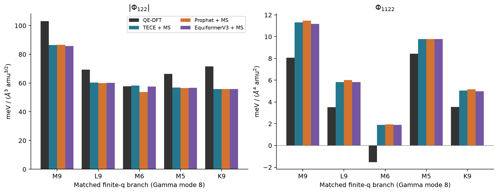
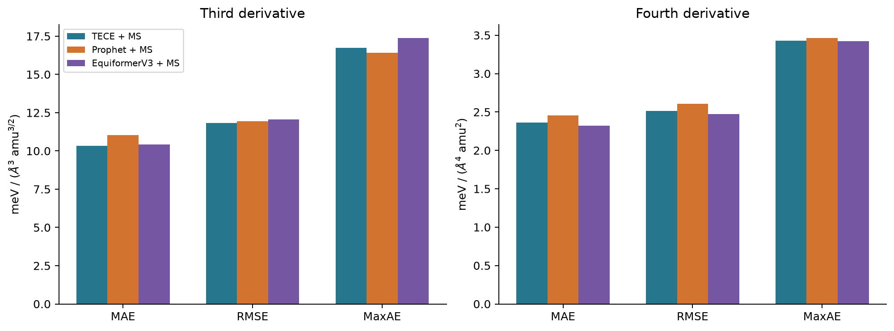
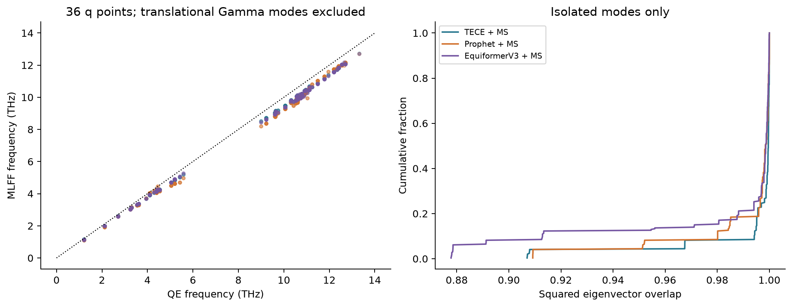
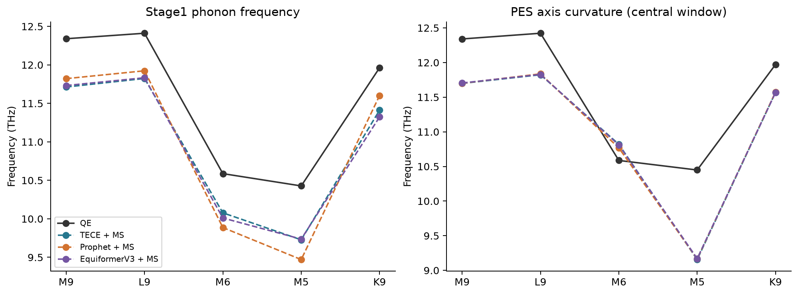
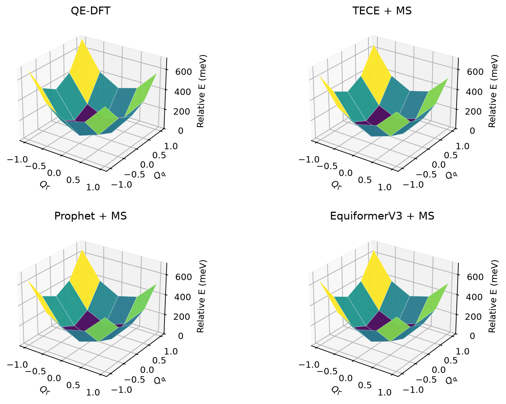
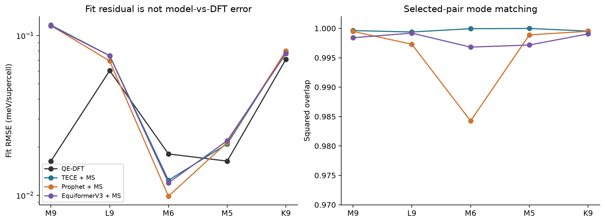
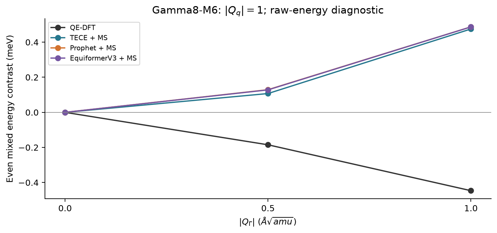
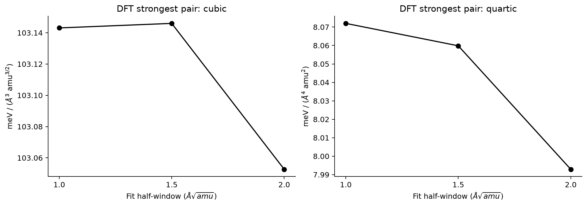
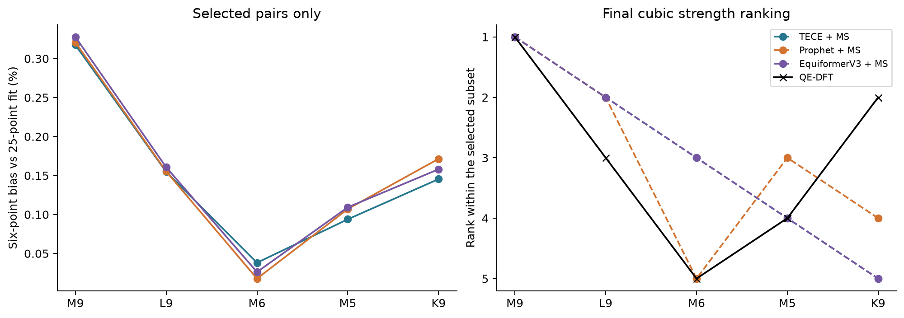

# WS₂：声子模式匹配、非线性耦合与 DFT 定量对照

数据范围：完整结果。证据截止 2026-09-25T05:09:36+00:00。

## 主要结果

本次复用已完成的 6×6 QE 声子，从当前 TECE＋MatterSim 排名前五选取物理通道；三条 MLFF 路线各自在自己的弛豫结构和模态基底上计算，再与匹配的 DFT 模式对比较最终耦合。

三阶强度的平均相对误差为：TECE＋MS 13.33%，Prophet＋MS 14.56%，EquiformerV3＋MS 13.39%。这组选择由 TECE 排名确定，不能作为所有模型或全候选的无偏精度估计。

三阶接近不能保证四阶正确：Γ8–M6 的 DFT 四阶混合导数为负，而三条 MatterSim Stage2 路线为正。三条路线共享 MatterSim，因此相近误差不足以单独归因于 Stage1 网络。结构变化与模态变化共同参与比较。

排序也有实质变化：在这五对内部，DFT 的 Γ8–K9 排第二，而 TECE＋MS、EquiformerV3＋MS 排第五，Prophet＋MS 排第四。全组 Spearman 分别为 0.3、0.7、0.3（TECE、Prophet、EquiformerV3）。这说明粗筛与自身精算一致，仍不能保证与 DFT 排序一致。

## 1. 五个物理通道的三阶、四阶结果

三阶比较 |Φ122|，消去 Γ 模式整体相位的任意符号；四阶比较有符号 Φ1122，其符号不随单个模式翻转。三阶单位为 meV/(ų·amu^(3/2))，四阶为 meV/(Å⁴·amu²)。

| DFT 模式对 | DFT 三阶强度 | TECE＋MS | Prophet＋MS | EquiformerV3＋MS |
| --- | --- | --- | --- | --- |
| Γ8–M9 | 103.143 | 86.407 | 86.718 | 85.757 |
| Γ8–L9 | 69.342 | 60.310 | 60.072 | 60.133 |
| Γ8–M6 | 57.719 | 58.312 | 53.828 | 57.555 |
| Γ8–M5 | 66.361 | 56.824 | 56.535 | 56.742 |
| Γ8–K9 | 71.607 | 55.868 | 55.901 | 55.826 |

逐对四阶混合导数：

| DFT 模式对 | DFT 四阶 | TECE＋MS | Prophet＋MS | EquiformerV3＋MS |
| --- | --- | --- | --- | --- |
| Γ8–M9 | 8.072 | 11.318 | 11.463 | 11.178 |
| Γ8–L9 | 3.531 | 5.824 | 6.010 | 5.835 |
| Γ8–M6 | -1.533 | 1.896 | 1.932 | 1.891 |
| Γ8–M5 | 8.445 | 9.781 | 9.778 | 9.777 |
| Γ8–K9 | 3.541 | 5.055 | 5.162 | 4.987 |

| 路线 | 三阶 MAE | RMSE | MaxAE | 平均相对误差 |
| --- | --- | --- | --- | --- |
| TECE + MS | 10.327 | 11.838 | 16.736 | 13.33% |
| Prophet + MS | 11.024 | 11.951 | 16.425 | 14.56% |
| EquiformerV3 + MS | 10.432 | 12.072 | 17.386 | 13.39% |
| 路线 | 四阶 MAE | RMSE | MaxAE |
| --- | --- | --- | --- |
| TECE + MS | 2.364 | 2.515 | 3.428 |
| Prophet + MS | 2.458 | 2.610 | 3.465 |
| EquiformerV3 + MS | 2.323 | 2.472 | 3.424 |

所有指标只覆盖已有 DFT 标签的选定通道。有限动量分支编号采用 DFT 基底；不同模型的同编号分支可能不是同一物理振动，原始编号和映射保存在随附 JSON/CSV。

本项目 q 点标记：M=(1/2,0)，K=(1/3,1/3)，L=(1/3,2/3)，均为倒格矢分数坐标。PES 使用最小相容超胞：M 为 2×2（12 原子），K/L 为 3×3（27 原子），并非 6×6 的 108 原子超胞。Q 为该超胞上质量范数为 1 的实模坐标；各模型对同一物理通道采用相同超胞大小，表中系数依赖此归一化。

## 2. 全网格频率与本征矢

完整 36 个 q 点用于匹配；精度汇总排除 Γ 的三个平移声学模，保留 Γ 光学模及全部有限 q 模，共 321 个模态。近简并组比较投影子空间，不将任意单支方向作为唯一物理本征矢。

| 路线 | 321 模态频率 MAE / THz | RMSE / THz | 孤立模重叠中位数 | 最差简并子空间重叠 |
| --- | --- | --- | --- | --- |
| TECE + MS | 0.4614 | 0.4938 | 0.99960 | 0.96766 |
| Prophet + MS | 0.5435 | 0.5964 | 0.99848 | 0.90806 |
| EquiformerV3 + MS | 0.4858 | 0.5263 | 0.99861 | 0.94577 |

三条路线孤立模的最差重叠平方依次为 0.9070、0.9092、0.8778；全网格并非每个单模都能可靠一一对应。此次选定五对的有限 q 模重叠平方均大于 0.984，且选中 Γ 与有限 q 分支不落入当前阈值的近简并组。

右图的 PES 频率来自中央 [-1,1] 坐标区间的轴向拟合。MLFF Stage1 频率分别来自 TECE／Prophet／EquiformerV3，Stage2 轴曲率则全部来自 MatterSim，二者不是同一个势的二阶响应；因此 Γ8–M6、Γ8–M5 等通道出现的明显差值不能只解释为拟合窗口误差。有限窗口及高阶项也可能贡献差异。频率、模式方向和高阶耦合的误差分别报告，不能相互替代。

## 3. 势能面、拟合残差与窗口

四幅图各自减去本方法的 Q=0 能量，Γ 和 M 模式符号按本征矢内积对齐，采用相同纵轴和质量归一化坐标；结构与模态允许等价而不要求原子位移逐点相同。因此这里不把跨图能量差定义成相同构型上的 MLFF 能量 MAE。

同理，不将不同结构／模态上的逐原子力差记作力 MAE。所有 QE 原子力仍完整保存在原始输出中，用于收敛、残余力与位移检查；本报告的 MAE/RMSE 比较对象是匹配通道的最终耦合或频率。

拟合残差衡量约定的 13 项多项式对离散势能面的描述误差；即使残差很小，模型对 DFT 的物理系数误差仍可显著。所有中央拟合的设计矩阵必须为满秩 13。表中导数由该有限窗口拟合的多项式求导得到，不等于已证明收敛到零振幅的精确 Taylor 导数，也不声称这 13 项包含所有允许的高阶单项式。

按中央设计矩阵伪逆估算，QE 打印能量舍入对三阶与四阶系数的最坏绝对扰动界分别为 0.00037、0.00142（各自导数单位），不足以解释 Γ8–M6 的四阶符号差异。此界只覆盖打印舍入，不包含 SCF、窗口截断或模型误差。

对 Γ8–M6，直接取四个 (±QΓ,±Qq) 角点能量的均值，再减去两条轴上 ±Q 的能量均值并加回原点能量，可消去纯轴项及奇次项，剩余主要为 Φ1122·QΓ²·Qq²/4 和更高偶次混合项。此检验不使用多项式拟合；两个非零振幅下 DFT 均为负，三条 MLFF 路线均为正。因此符号差异也存在于原始能量组合，仍须区别于四阶导数已在任意窗口收敛的断言。

窗口诊断目前只针对最强 Γ8–M9。其他四对只有中央 5×5 DFT 标签，不据此声称其四阶系数也经过窗口收敛验证。

## 4. DFT 数值收敛与数据来源

最强通道六点 Φ122：100/1000 Ry、等效 24×24 k 网格 -103.114963；120/1200 Ry -103.180747；等效 30×30 k 网格 -103.114963。截断能引起 0.0638% 变化，低于预先设定的 2% 门槛。

k 网格检查的六点组合在当前打印精度内相等，不代表数学上完全无误差。QE 总能量以 10⁻⁸ Ry 输出，量化步长 1.36e-07 eV；两个六点三阶估计之差的保守舍入界约 0.000544（三阶单位）。检查的是组合后的耦合量，原始单点能量并不完全相同。

另核对了不同声子对中重合的纯 Γ 轴构型：10 组、每组 2–3 次独立 QE 计算，最大能量差 0 eV（受相同输出精度限制）。这些重复物理构型是各对网格原有的轴点，不是控制器重复提交同一任务；193 是作业／网格记录数，并非193个互不相同的原子构型。

参考使用 2026-03-31 WS₂ PZ-LDA 归档，DFPT 100/1000 Ry、30×30×1 k 网格、6×6×1 q 网格；本次从既有力常数导出完整声子网格，没有新增 DFPT。q2r/matdyn 使用 simple 平移 ASR，不能视为二维 ZA 转动求和规则已满足。没有引入 SOC 或非解析 LO–TO 修正。

旧 BFGS 曾因历史重置终止，未满足当时严格弛豫条件，末态残余力约 4.13×10⁻⁴ eV/Å。此次沿用该实际 DFPT 结构，保留这一限制。新势能面所有能量、原子力与输入哈希已核验；坐标检查允许周期边界下的整数晶格平移。

| 参考／Stage1 | 面内晶格 a / Å | 相对 QE |
| --- | --- | --- |
| QE-DFT | 3.120732 | +0.000% |
| TECE + MS | 3.191568 | +2.270% |
| Prophet + MS | 3.192284 | +2.293% |
| EquiformerV3 + MS | 3.190487 | +2.235% |

这是一组对项目既有 PZ-LDA 参考的复现测试。MatterSim 训练标签采用 PBE（部分氧化物／氟化物加 U），与此处硫化物的 PZ-LDA 参考并非同一泛函；势、弛豫结构和模态基底的差异同时参与误差，不能把偏差全部归因于网络拟合。MatterSim 原始论文的训练设置见 [arXiv:2405.04967，S5](https://arxiv.org/html/2405.04967v1#S5)。本轮不追加另一套泛函计算。

## 5. 计算成本与工程结论

| 计算 | 样本点数 | 单点秒数 | 范围／口径 |
| --- | --- | --- | --- |
| QE，12 原子，64 MPI 核 | 131 | 160.96 | 70.28 - 283.44 |
| QE，27 原子，64 MPI 核 | 50 | 592.60 | 322.47 - 649.42 |
| TECE + MS，4 推理线程 | 405 | 0.0412 | 每点均值；不含装载 |
| Prophet + MS，4 推理线程 | 405 | 0.0452 | 每点均值；不含装载 |
| EquiformerV3 + MS，4 推理线程 | 405 | 0.0409 | 每点均值；不含装载 |

QE 使用独占节点、64 个物理核 MPI 和 8 个 k 点池；MatterSim 每进程 4 推理线程、权重常驻内存。这里是实际运行配置的成本，不是相同核数下的架构速度比。QE 单点时间含启动与 SCF；MatterSim 点时间不含模型首次装载。

服务器关闭了 Slurm 作业内存统计；计时器记录到的数 MB 是 mpirun 启动器，不能当作 QE 内存。本次另做节点内进程采样，RSS 汇总会重复计入共享页，也不能代表整个作业生命周期的峰值。

取得 2 次各含 64 个 pw.x 进程的采样，最大观察 RSS 汇总 45.96 GiB。可用 PSS 汇总最大观察值 43.51 GiB；这是瞬时采样值，不是全作业峰值。

控制器记录 193 个唯一 QE 作业 ID；逐轮观测的全账号排队／运行节点最大值为 10，单轮最多提交 5 个。观测到的失败数为 0。这是控制器轮询记录，非连续调度器轨迹。

Slurm 记账中的 QE 已完成作业合计分配 903.70 核时，包含启动与收尾开销。三条 MLFF 路线的 1215 点在一个 8 核作业中完成，作业墙钟 42 秒，使用两个各 4 线程的工作进程；该总时间包含装载和收尾，不能与上表的不含装载点均值混用。

## 6. 六点粗筛能解决什么

| 路线 | 六点相对中央拟合最大偏差 | 五对内部 Spearman（对 DFT） |
| --- | --- | --- |
| TECE + MS | 0.318% | 0.300 |
| Prophet + MS | 0.321% | 0.700 |
| EquiformerV3 + MS | 0.328% | 0.300 |

上述六点数据由同一批 9×9 MLFF 原始能量抽取，不需要新推理。六点相对于 25 点将候选逐对的评估点数减少 76%；这只是每个候选的点数节省，不含 Stage1 和最终精算。Spearman 仅衡量这五个既定通道内部的排序；并非全候选 top5 召回率。

DFT 在此子集的顺序为 M9 > K9 > L9 > M5 > M6；TECE＋MS 为 M9 > L9 > M6 > M5 > K9。Γ8–K9 的 DFT 三阶强度为 71.607，三条 MLFF 路线约 55.8–55.9，误差约 22%。因此进一步加密同一 MLFF 的网格难以消除主要排序偏差；高通量筛选应保留较宽的入选范围，再针对候选阈值附近和代表性失配通道做有限 DFT 校验。

目前适合继续采用六点全候选粗筛、少量通道补齐中央网格的流程。此次 DFT 仅覆盖选出的五对，能检查这些通道的最终精度，不能证明粗筛在整个候选集上的 DFT top-k 召回率。四阶系数出现符号差异，应作为后续校正的单独目标，而非被三阶平均误差掩盖。

## 可复核数据

[完整证据与来源哈希](acceptance_data/ws2_dft_top5.json)；[逐对数值表](acceptance_data/ws2_dft_top5.csv)。研究计算与原始 QE 输出保留在隔离测试目录，公开稳定包仍只包含两阶段 MLFF 流程。
