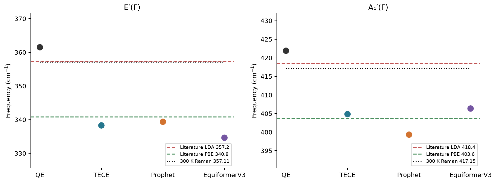
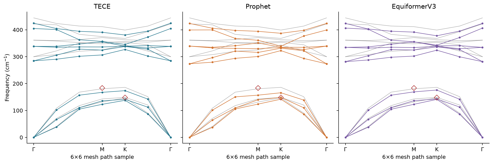

# WS₂ 声子谱与单层文献结果的定量对照

本报告读取已核验的 36 点 QE 与三条自行弛豫 MLFF 声子数据，所有数值统一换算为 cm⁻¹（1 THz = 33.35640952 cm⁻¹）。表中 TECE、Prophet、EquiV3 均为 Stage1 力常数与 Phonopy 声子结果；MatterSim 只参与后续 Stage2 势能面，不影响本报告的声子频率。不新增声子或 DFT 计算。

## 1. Γ 点：同层数、同模态的直接数据

模式由原子振动方向和已核验的本征矢映射决定：E′ 为 Γ 第 6/7 支的面内双重态，A₁′ 为第 8 支的 S 原子面外振动。模型双重态取两支的平均；没有按频率最近邻临时换支。文献来自 Wilczyński 等的单层 WS₂ 补充材料表 S1/S3：LDA-PW92、PBE 谐波频率及 300 K Raman 实测值。

| 模式 | LDA | PBE | Raman | QE | TECE | Prophet | EquiV3 |
| --- | ---: | ---: | ---: | ---: | ---: | ---: | ---: |
| E′(Γ) | 357.20 | 340.80 | 357.11 | 361.50 | 338.29 | 339.38 | 334.63 |
| A₁′(Γ) | 418.40 | 403.60 | 417.15 | 421.91 | 404.83 | 399.32 | 406.34 |

这两个 Γ 模的平均绝对差（cm⁻¹）对文献 LDA：QE 3.90、TECE 16.24、Prophet 18.45、EquiformerV3 17.31；对文献 PBE：QE 19.50、TECE 1.87、Prophet 2.85、EquiformerV3 4.46。这些只是两项 Γ 模指标，不能推广成整条声子谱的 MAE。

本项目 QE 的晶格常数 3.12073 Å，比文献 LDA 的 3.142 Å 小 0.68%；模型自弛豫值约 3.190–3.192 Å，比该文 PBE 的 3.206 Å 小约 0.43–0.48%。QE 的两个亮模比文献 LDA 高约 3–4 cm⁻¹；三条 MLFF 的值整体更接近文献 PBE 范围。这与结构和泛函差异方向一致，但不能据此确定各自误差的因果比例。归档 QE 结构的 BFGS 未达到严格终止条件，残力约 4.13×10⁻⁴ eV/Å；300 K Raman 还包含温度、衬底和测量条件影响。

## 2. M、K 点：二阶 Raman 的间接参照

另一篇单层 WS₂ 工作的表 1 将 367 cm⁻¹ 计算峰指认为 2LA(M)、296 cm⁻¹ 指认为 2TA(K)；相应实测峰为 369、298 cm⁻¹。下表将峰位置除以 2，用于判断相关声学模量级。它们来自共振二阶过程，可能受声子非谐性和实际散射动量影响，因此不纳入直接声子频率 MAE。M 的 LA 对应 QE 第 3 支；K 选择以面内运动为主的 QE 第 1 支作为 TA 类分支，高对称 K 点的本征态不必具有纯横向极化，因此这项对应属于参考性判断。三模型对所选 QE 单模的重叠平方均超过 0.999。

| 模式 | LDA 峰/2 | Raman 峰/2 | QE | TECE | Prophet | EquiV3 |
| --- | ---: | ---: | ---: | ---: | ---: | ---: |
| LA(M) | 183.50 | 184.50 | 180.79 | 167.42 | 157.00 | 169.16 |
| TA(K) | 148.00 | 149.00 | 146.80 | 137.74 | 141.98 | 141.15 |

图中仅使用现有 6×6 网格上的 Γ–M–K–Γ 七个采样点，黑色是本项目 QE，彩色是对应 MLFF，空心菱形是文献二阶峰折半值。线只连接按频率排序的支序，未做逐段本征矢连续追踪，故交叉处不作分支拓扑判断；它也不是把文献曲线逐点数字化后的全谱误差。

## 3. 声学—光学分隔与解释

| 路线 | 最高声学模 | 最低光学模 | 间隙 |
| --- | ---: | ---: | ---: |
| Archived QE LDA | 186.00 | 299.94 | 113.95 |
| TECE | 173.65 | 284.58 | 110.93 |
| Prophet | 165.87 | 273.53 | 107.67 |
| EquiformerV3 | 175.96 | 281.55 | 105.59 |

间隙定义为全 6×6 网格最低第 4 支减去最高第 3 支。Molina-Sánchez 与 Wirtz 的单层 WS₂ LDA 声子谱文字报告约 110 cm⁻¹ 的声学—光学间隙；本项目四条线为约 106–114 cm⁻¹，均保持这一整体结构。四条线在 Γ、M、K 个别模态的绝对频率仍可差十几到二十几 cm⁻¹，因此间隙接近不能替代逐模检验。

本项目仅使用 Phonopy 平移声学求和规则，未证明二维 ZA 的转动规则；Γ 邻域 ZA 曲率不用于此处打分。文献中的结构优化、赝势、真空、k 网格、SOC/非解析修正和 Raman 温度不同。上述数据应按模态、参考泛函与测量类型阅读，不能把全部差值归因于模型本身。已有完整 321 模态 QE 对照见[WS₂ DFT 定量报告](WS2_DFT_COMPARISON.md)。

## 来源与可复算数据

1. Wilczyński 等，*Acta Materialia* 240 (2022) 118299，[原作者补充材料，表 S1/S3](https://nano.fizyka.pw.edu.pl/_uploads/j.actamat.2022.118299_SI.pdf)；DOI: 10.1016/j.actamat.2022.118299。

2. Liu 等，*Scientific Reports* 8 (2018) 11398，[单层 WS₂ 深紫外 Raman，表 1](https://pmc.ncbi.nlm.nih.gov/articles/PMC6065453/)；DOI: 10.1038/s41598-018-29587-0。

3. Molina-Sánchez 与 Wirtz，*Physical Review B* (2011)，[单层 WS₂ 声子谱](https://arxiv.org/abs/1109.5499)；arXiv:1109.5499。

[逐点数值与来源类型](acceptance_data/ws2_literature_phonons.csv)；[来源、模式选择及计算值 JSON](acceptance_data/ws2_literature_phonons.json)。
