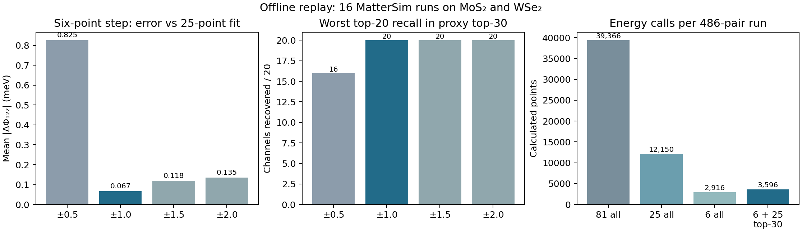

# MoS₂/WSe₂ 全量模型测试与低成本粗筛分析

**2026-09-24。结论：**在已完成的 MatterSim 能量网格上，当前最合适的粗筛是对全部 486 个模式对先计算 `QΓ=±1、Qq=−1,0,+1 Å√amu` 的六个能量点，按完整 Γ 子空间的 `||Φᵢqq||` 给通道排序，再把前 30 个通道补齐到中央 5×5 网格。16 条运行中，这一代理前 30 **均覆盖**对应完整中央 5×5 拟合的前 20 个通道，需计算约 3,562–3,619 个能量点/条，约为原 9×9 全量计算的 **9.05–9.19%**。这是对同一 MatterSim 结果的离线回放，不是 DFT top-20 召回率，也不是已经测得的 Slurm 墙钟加速。

## 结果范围与可比性

已核实的 Phonopy 2.38.0＋平移 ASR 主实验有 4 种 Stage1（Prophet、EquiformerV3＋DeNS、TECE、EquFlashV2 CPU 兼容路径）×2 种材料×2 条结构线，共 **16 条 MatterSim Stage2**。每条均有 36 个 q 点、6 个有限 q 等价类、486/486 模式对、每对 81/81 个有限能量值及满秩的中央 25 点拟合；合计 **7,776 个能量网格、629,856 个能量点**。全部 7,776 份原始网格已从服务器只读归档用于本次回放。重新拟合的三阶/四阶导数与保存的排名表的最大绝对差分别小于 `3.4×10⁻¹⁰`/`1.4×10⁻⁹` meV。源结构、模式文件和 MatterSim 权重哈希由原有运行验证器逐条校验；MatterSim 权重 SHA256 为 `e3df9fa708725e3d453140646c7d1838324b347a3d1214cf1440522146f872b5`。

另有**旧自写 Stage1 模式基**上的 Prophet Stage2 四条线均完成 486 对，其中两种材料的共用结构各有同模式基 MatterSim 对照；这四条不可与新的 Phonopy 模式文件按同名分支逐点混合。已有 QE 高阶势能面只找到两材料各五对旧选中方向，并非本项目预定的共同 30 对。用户暂停 Stage3 后没有新增 QE 单点，因此下文不声称完整 DFT 三/四阶误差或 DFT 排名召回。BN 与 1/2/3 原子测试提供接口/解析覆盖，不属于本次两材料全量物理比较。

原始运行目录是本地 `/Users/lmtsakura/Documents/ChatGPT/dp/work/prophet-stage12-v3-validation` 与服务器 `/home/lmtsakura/qiyan_shared/testing/prophet-stage12-v3/validation`。六点回放的可复算脚本为 `scripts/analyze_coarse_screening_campaign.py`，逐条结果在 `reports/coarse_screening_replay_20260924.json`；服务器 7,776 份网格的只读打包副本在本地 `/Users/lmtsakura/Documents/ChatGPT/dp/work/coarse-screening-analysis-20260924/energy_grids.tar.gz`，SHA256 为 `f4c20dbe530ee746980160c4e1f67b016babdd017ab94b6136ab3d260a86ac99`。模型频率、耗时及严格 0.01 THz 通道映射在 `reports/phonopy_model_campaign_gamma001_20260924.json`；旧 0.1 THz 版本仍保留于 `reports/phonopy_model_campaign_20260924.json`。以下归档 QE 比较均针对共用输入结构；QE 原始几何没有独立核实，WSe₂ 旧 QE 的 Γ 声学频率还没有与本轮相同的 ASR 处理。

## Stage1：谐波精度、模式基与计算代价

以下频率 MAE 为 36×9 模式映射后的历史 QE 描述性对照，单位 THz；重叠是孤立模的本征矢重叠²中位数。CPU 秒是各共用结构完整 Stage1 的归档计时，设备和线程实现不同，不是模型固有推理速度。

| Stage1 | MoS₂ MAE | WSe₂ MAE | MoS₂ 重叠² | WSe₂ 重叠² | MoS₂/WSe₂ Stage1 秒 |
| --- | ---: | ---: | ---: | ---: | ---: |
| Prophet | 0.1645 | 0.1625 | 0.99880 | 0.99601 | 116 / 117 |
| EquiformerV3＋DeNS | 0.0822 | 0.1079 | 0.99916 | 0.99849 | 49 / 49 |
| TECE | **0.0660** | 0.1259 | **0.99958** | **0.99905** | 69 / 69 |
| EquFlashV2 CPU 兼容路径 | 0.0898 | **0.1061** | 0.99906 | 0.99770 | 1,374 / 1,395 |

TECE 的 MoS₂ 频率最接近旧 QE；WSe₂ 的 EquFlashV2 与 EquiformerV3 差约 0.0017 THz，EquiformerV3 的 CPU 成本小得多，且 EquFlashV2 的兼容路径尚未与官方 CUDA 路径逐点核验。因此当前研究线可用 TECE 做 MoS₂ 的 Stage1 替代对照、EquiformerV3 做 WSe₂ 的替代对照；已完整回归的 Prophet＋MatterSim 仍保留默认线。旧 QE 的几何和 WSe₂ Γ-ASR 不一致意味着这不是严格同条件模型排行榜。Phonopy 的平移 ASR 也未解决二维 ZA 的转动求和规则与 6×6 网格外近 Γ 色散；不能据此宣称完整声子谱收敛。

±0.01 与 ±0.005 Å 力差分的最大频率变化，EquiformerV3/TECE/EquFlashV2 的各条线均不超过约 0.00065 THz。Prophet 自行弛豫线较敏感：MoS₂ 最大 0.02447 THz，WSe₂ 最大 0.00703 THz。只读检查保存的两套力常数后，最大差都位于 Γ9 光学支，而非声学支或分支重排；MoS₂ 的 13.65458→13.63011 THz、WSe₂ 的 8.93267→8.92564 THz。它们不妨碍本次强通道排序回放，但若要引用自行弛豫 Prophet 的精细频率，必须报告步长敏感性。

## Stage2：换 Stage1 后的强耦合排序

共用结构、同一 MatterSim Stage2 下，相对 Prophet Stage1 的物理通道排名如下。跨模型先按复本征矢匹配，Γ 近简并组取 `||Φᵢqq||`；WSe₂/EquiformerV3 有十个有限 q 通道的单模重叠²低于 0.9，但均不在双方前 30。此处仍以代表 q 点的单个有限 q 分支为目标；若目标支自身近简并，它的单支排名可能依赖基底选择，需另做完整子空间比较。

| 材料、Stage1 替代 | 前 5 / 10 / 20 / 30 通道重合 | 可靠通道强度秩相关 |
| --- | --- | ---: |
| MoS₂ EquiformerV3 | 5 / 10 / 20 / 30 | 0.860 |
| MoS₂ TECE | 5 / 10 / 20 / 29 | 0.895 |
| MoS₂ EquFlashV2 | 5 / 9 / 20 / 28 | 0.890 |
| WSe₂ EquiformerV3 | 5 / 10 / 20 / 29 | 0.886 |
| WSe₂ TECE | 5 / 10 / 20 / 28 | 0.921 |
| WSe₂ EquFlashV2 | 5 / 10 / 19 / 28 | 0.901 |

前列强通道稳健，而弱通道的次序不稳健。固定 MatterSim 后，各模型的首位都是 Γ8–M 强通道：MoS₂ 的 `|Φ₁₂₂|` 为 98.62–99.28，WSe₂ 为 31.13–31.27 meV/(ų·amu³ᐟ²)。不同 Stage1 得到近似排名**不等于**不同 Stage1 的三阶模态张量已经对 DFT 准确。内部一致性也不同：MatterSim 势能面拟合的有限 q 频率与 Stage1 频率的绝对差中位数，MoS₂ 的 Prophet/EquiformerV3/TECE/EquFlashV2 分别是 0.210/0.332/0.306/0.271 THz，WSe₂ 分别是 0.166/0.203/0.197/0.215 THz。更接近旧 QE 的 Stage1 频率并未自动带来与固定 MatterSim 势能面更自洽的曲率。以筛选为目的可先用强度排序；要做定量动力学则须补做同位移的二阶与高阶校准。

**自行弛豫结构单独比较。** 相对同模型的共用输入结构，MoS₂/WSe₂ 的全网格频率平均变化约为 0.50–0.57/0.41–0.43 THz；首位耦合从约 99 降至 89 meV、从约 31.2 降至 26 meV。这大于不少模型间固定结构的频率差，不能把模型与结构效应混为一谈。按下述收紧后的 Γ 分组重算，EquiformerV3/TECE/EquFlashV2 与 Prophet 自行弛豫线的前 20 通道重合为 MoS₂ **19/19/19**、WSe₂ **19/19/20**；由于各模型弛豫后的结构哈希不同，这只是结构加模型共同变化下的描述性结果。

旧 Prophet Stage1＋Prophet Stage2 与旧 Prophet Stage1＋MatterSim Stage2 在相同共用结构和模式文件上的前 20 通道重合为 MoS₂ **16/20**、WSe₂ **19/20**；Prophet 前 30 均覆盖 MatterSim 前 20。物理通道强度秩相关为 0.867/0.877。但 Prophet Stage2 的逐对耗时累加为 137.2/118.4 小时，同批 MatterSim 为 3.06/2.48 小时，约 45/48 倍。不同实现与节点条件不允许把该倍数当作普适速度定律；它足以说明本次运行中再加一层 Prophet 全网格粗筛不会节省计算。新 Phonopy＋MatterSim 的 16 条 Stage2 逐对累计时间每条约 1.16–1.25 小时，实际多工作进程 Slurm 墙钟取决于节点分配。

## 旧 QE 对照能说明什么

旧 QE 只覆盖 MoS₂/WSe₂ 各五个**先前已挑出的强方向**，而且实模坐标需要归一化重拟合或缩放；故只能作方向代理，不能给出 486 对的 DFT 排名召回或全域 MAE/RMSE。它们的 `|Φ₁₂₂|` 在四条共用结构 MatterSim 线中都排在前六。旧 QE 的首位 MoS₂ Γ8–M9 为约 106.13 meV，对应 MLFF 为 98.62–99.28 meV；WSe₂ 首位旧 QE 约 30.58 meV，对应 MLFF 为 31.13–31.27 meV。五对强方向的幅值相对差中位数：MoS₂ 约 5.65–5.93%，WSe₂ 约 0.21–0.78%；MoS₂ Γ8–K9 偏差约 12%。这些数字不能外推到未选择的通道、近简并张量范数或四阶导数。没有可比的整套 QE 原子力和同位移能量标签，因此本次不能提供能量/力 MAE、RMSE。

四阶尤其需要谨慎。7,776 份 MatterSim 网格中有 2,778 份（35.7%）因重复能量值被标记，代表网格的量化步长与 float32 总能量一致。六点模板在 ±0.5 时的三阶误差显著放大。九点模板在 ±1 时对中央 25 点四阶拟合的平均 MAE 约 **0.462 meV/(Å⁴·amu²)**、平均绝对值秩相关约 **0.881**；把同一完整网格的拟合窗口扩大到 7×7/9×9，四阶 MAE 平均约 **0.510/0.554 meV**、秩相关仅 **0.751/0.715**。个别强对例如 MoS₂ Γ8–M9 的 `Φ₁₁₂₂` 可从 5×5 的约 16.28 变到 9×9 的约 6.98。四阶不能用六点三阶粗筛替代，也不能仅凭 9 点差分声称收敛。

## 粗筛回放：点数、误差与强通道召回

每个六点模板在 `QΓ=±h` 各取 `Qq=−h,0,+h`，以 `∂³E/∂QΓ∂Qq²` 的中心差分作 `Φ₁₂₂` 代理。它们只比较同一 MatterSim 模式基与同一结构的中央 25 点拟合结果。所有 Γ 子空间分量都保留；先计算每个分量的代理，再取通道向量范数。下表的均值及最差召回跨上述 16 条运行，故不是 16 个独立材料的外推精度。

| 六点位移 `h` (Å√amu) | 模式对 `Φ₁₂₂` MAE 均值 (meV) | 物理通道秩相关均值 / 最低 | 精确前 20 与代理前 20 重合范围 | 代理前 30 覆盖精确前 20 的最差数 |
| --- | ---: | ---: | ---: | ---: |
| 0.5 | 0.825 | 0.859 / 0.794 | 14–19 | **16/20** |
| **1.0** | **0.0665** | **0.949 / 0.933** | **19–20** | **20/20** |
| 1.5 | 0.118 | 0.896 / 0.847 | 19–20 | 20/20 |
| 2.0 | 0.135 | 0.886 / 0.849 | 19–20 | 20/20 |

±1 的六点模板在这批数据中兼顾能量量化与高阶非线性污染：±0.5 对浮点能量台阶过敏，±1.5/±2.0 更受较大位移的非局域项影响。它不是普适最优步长；换模型精度、材料或坐标规范后应先用已完成的全量网格回放或少量试点重新标定。

| 每条 486 对运行的方案 | 能量点数 | 原 9×9 的比例 | 这批数据上的目的 |
| --- | ---: | ---: | --- |
| 全量 9×9 | 39,366 | 100% | 原始网格与窗口诊断 |
| 全量中央 5×5 | 12,150 | 30.9% | 与现有 `Φ₁₂₂/Φ₁₁₂₂` 主拟合**完全相同**；外侧 56 点不参与主拟合 |
| 全量六点 ±1 | 2,916 | 7.41% | 只给三阶排序代理，不能给稳定四阶 |
| 六点全量＋代理前 30 通道补到 5×5 | **3,562–3,619** | **9.05–9.19%** | 选中通道展开为 34–37 对；六点已在 25 点内，每对只需补 19 点 |

后一方案在这 16 条线中完整覆盖了中央 25 点参照的前 20 通道。代理**只取前 20**会在若干线漏 1 个；前 25 在这批数据也全部覆盖，但前 30 留出更合理的模型/结构边界裕度。原 Stage2 的点级检查点应支持先算六点、再按选中通道补中央 19 点；新的作业调度与排名协议尚未作为生产稳定流程验收。点数约减少 11 倍不代表墙钟必然减少 11 倍，实际需测模型装载、批量推理、进程数、文件写入与共享节点争用。

7×7 与 9×9 的三阶通道排序相对中央 5×5 的前 20 最少仍重合 19 个，前 30 均覆盖中央前 20；但它们的四阶窗口敏感性明显。因此生产方案应把中央 25 点作为入选对的主拟合，把外圈 9×9 留给少量最终强对做窗口/残差审计，**不**用 81 点对所有 486 对常规筛选。

## 建议的运行判据与下一步

1. **Stage1**：保留 Phonopy＋ASR 的完整 6×6 网格、有限 q 等价类和所有 Γ 分量；前置记录通道成员，不按声学/光学或模型预测强度删候选。当前以 0.01 THz 作为 Γ 光学近简并的默认阈值。旧 0.1 THz 会将 Prophet 自行弛豫 WSe₂ 的 Γ6/7（约 7.084 THz）和 Γ8（约 7.177 THz）偶然并组，使通道数从 270 降至 216；本轮按 0.01 THz 重新分析，旧文件和原始 486 对不改写。频率邻近本身不是群论简并证明，未来如要推广到其他晶体需验证实际结构点群与子空间映射。
2. **三阶粗筛**：用 MatterSim 在固定 Stage1 模式和结构上完成 486 对×6 点的 ±1 模板；对每个通道计算完整 `||Φᵢqq||`，保存点级能量、哈希及排序。代理前 30 通道补齐中央 25 点后重新排序；如果第 20–30 名附近得分接近、重算后前列变化明显或质量标记集中，则扩到前 40，而非人为删分支。
3. **精查**：对最终少量强对补 9×9 外圈与拟合窗口检查，尤其四阶；复核 Stage1 和 Stage2 二阶曲率是否一致。已暂停的 DFT Stage3 只有在恢复后，才能以同结构、同实际位移的能量及力检验真实召回率和高阶误差。当前不能把 MatterSim 的内部参照称为 DFT 真值。

在现有两材料上，粗筛算法应优先优化**同一 MatterSim 的势能调用量和强通道召回**，再比较 Stage1 选择的谐波准确度与模式基可靠性。把参数更多的 Stage1 模型或 Prophet Stage2 作为额外必经筛选，会增加成本，却没有从当前数据证明能更好保住 DFT 强通道。生产化六点流程前，应在测试工作树实现“六点→通道前 30→补 19 点→可选外圈”的续算协议并做一条真实 CPU 墙钟试运行；本报告只验证了离线数值与调用量。
