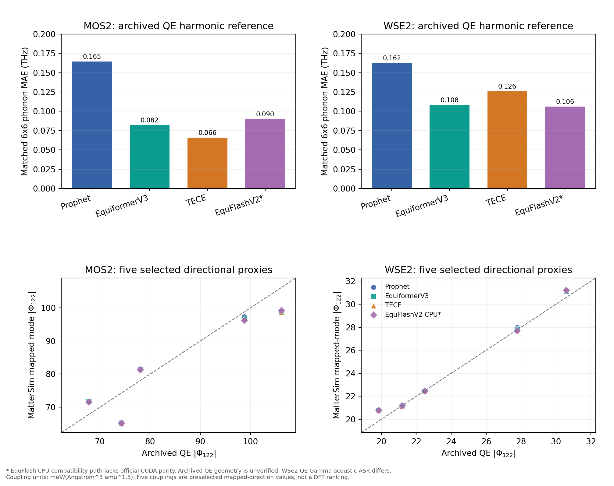

# Phonopy Stage1＋MatterSim Stage2：模型替代、历史 QE 对照与稳定版验收

**日期：2026-09-24。** 本报告使用 `scripts/analyze_phonopy_model_campaign.py` 对每条完整运行的结构、模式对、MatterSim 权重和 486 个结果逐一校验；汇总指标、来源哈希、前列物理通道和旧 QE 五对映射保存在仓库 `reports/phonopy_model_campaign_20260924.json`，完整逐模和逐对原始文件保留在下述运行目录。本轮没有启动新的 QE/DFT 作业。这里的“共用 DFT 结构”仅指所有模型读取同一份历史 QE 输入结构文件；归档 QE 原始计算的几何来源没有独立核实。

原始运行根目录：本地 `/Users/lmtsakura/Documents/ChatGPT/dp/work/prophet-stage12-v3-validation`，服务器 `/home/lmtsakura/qiyan_shared/testing/prophet-stage12-v3/validation`。在仓库根目录可用 `python -m scripts.analyze_phonopy_model_campaign --data-root <本地运行根目录> --output <输出.json>` 重新校验；脚本遇到哈希、模型或结果数量不一致会报错，不会默默跳过。报告中的舍入值均以该 JSON 和保留的原始运行文件为准。

## 结论与决策

1. 稳定代码现以 **Phonopy 2.38.0＋平移声学求和规则（ASR）** 为 MLFF Stage1 默认。Prophet、EquiformerV3、TECE、EquFlashV2 共用结构上的 6×6×1 网格均生成 36 个 q 点、35 个有限 q 点、6 个对称等价类及 486 个 Γ–q–(−q) 候选。Stage2 固定使用同一 MatterSim 权重、81 点势能面和中心 25 点三/四阶导数拟合。自行弛豫结构在各模型自己的目录计算，不与共用结构的 QE 频率误差合并。
2. 归档 QE 谐波频率的描述性比较中，MoS₂ 的 TECE 最接近，WSe₂ 的 EquFlashV2 CPU 兼容路径与 EquiformerV3 很接近；这些模型都比 Prophet 的全网格平均频率误差小。单模与简并子空间仍须分别映射。频率更好**不自动意味着**高阶非线性耦合更好。
3. 在同一 MatterSim Stage2 下，Prophet、EquiformerV3、TECE 的前 20 个**物理耦合通道**在 MoS₂ 和 WSe₂ 上完全一致；EquFlashV2 与 Prophet 的前 20 在两材料分别重合 20、19 个。因而当前最有根据的工程选择是把 Stage1 当作寻找和标记可靠模式基的步骤，Stage2 用 MatterSim 对全部候选排序，再按已核实的强通道筛选。这是本轮两材料的结论，不能推广到其他材料或未知低排名通道。
4. 与两材料各五对已找到的旧 QE 非线性势能面对照时，四模型的 MatterSim 三阶强度代理均命中这些已选对的全量排名前六。由于五对本来是旧筛选中的强对，这**不等于**“DFT top-5 召回率”或 486 对的 DFT 排名。近简并单支和旧 v2 模坐标也使这些百分数只适合作描述性方向代理。四阶系数受 MatterSim 能量量化和拟合窗口影响，当前证据不足以声称四阶准确。

因此目前保留 **Prophet＋MatterSim** 为已完整回归的默认组合；在研究运行中，MoS₂ 可优先试 TECE Stage1、WSe₂ 可优先试 EquiformerV3 Stage1，再由 MatterSim 排序。这个选择依据是当前归档 QE 谐波指标、相同 Stage2 的前列通道稳定性和 CPU 成本；它不是经过新同结构 DFT 三/四阶张量认证的普适模型优劣排序。EquFlashV2 虽已完成共用结构 Stage2，但 CPU 耗时较高且 CUDA 数值等价未核验，仍列为诊断性候选。

## 固定流程、单位与复现边界

Stage1 在相同输入文件上由每个模型提供能量/力，Phonopy 从 ±0.01 Å 中心差分构建超胞力常数；再以 ±0.005 Å 复算完整力常数并检查频率收敛。完整超胞力常数调用 `symmetrize_force_constants(level=1)` 施加平移 ASR 和指标交换对称性，保留修正前后诊断。六方点群只用于 q 点等价类，**不删除**模式分支；候选只受 Γ–q–(−q) 动量守恒筛选。相位及实模规范固定为 v3，实位移的质量加权范数为 1。不同模型之间先按 q、复相位及本征矢重叠映射，近简并 Γ 组以 `||Φᵢqq||` 比较；不要求实驻波逐点相同。

Stage2 对每对在 `Q₁,Q₂=−2,…,2 Å√amu` 以 0.5 步长计算 9×9 总能量网格；以中心能量为零点，取中央 5×5 拟合 13 列多项式。`Φ₁₂₂` 是对 `Q₁ Q₂²` 的三阶导数而非原始多项式系数，单位 meV/(ų·amu³ᐟ²)；`Φ₁₁₂₂` 单位 meV/(Å⁴·amu²)。每条完整运行均通过结构哈希、模式文件哈希、同一 MatterSim 检查点、36 q、486 个不同模式码、486 个满秩拟合验证。原始 81 点、点级检查点和耗时留在服务器运行目录。MatterSim 检查点 SHA256 为 `e3df9fa708725e3d453140646c7d1838324b347a3d1214cf1440522146f872b5`。

| Stage1 模型 | 固定源码提交前缀 | 权重 SHA256 前缀 | 本轮设备 |
| --- | --- | --- | --- |
| Prophet OAME-MBD | `c4fda8251d8a` | `28b21122f4c6` | CPU |
| EquiformerV3＋DeNS-OAM | `a7300c58df68` | `429ccded9816` | CPU |
| TECE-OAM-RRA-1.0 | `81f65a4c188b` | `9f36562582d9` | CPU |
| EquFlashV2-45M-OAM | `16b5cae47437` | `068ce25767d5` | CPU 兼容路径 |

以旧 QE 谐波为描述性参照有两个限制。MoS₂ 归档后处理用 `asr='simple'`；WSe₂ 归档 12×12 动力学矩阵的 6×6 子网格用 `asr='no'`，其 Γ 三条声学频率约为 −0.442、+0.494、+0.518 THz，故不能拿 Γ 声学支作 MLFF 准确度结论。WSe₂ 历史 QE 输入与当前输入的 Se 坐标还相差约 0.000378 Å。转换后的 QE 数据虽然按本轮输入标有结构哈希，`qe_geometry_verified=false` 仍明确表示原始 DFT 几何**未核实**。更多 ASR 与低 q ZA 讨论见 [Phonopy ASR 对照](phonopy_asr_dft_comparison.md)。

## Stage1：完整 6×6 谐波网格与归档 QE

以下 MAE 单位 THz；“孤立模重叠²”是与归档 QE 映射后的中位数，近简并支按子空间另行核对。全网格为 36×9＝324 支；有限 q 声学/光学分别为 105/210 支。

| 材料 | Stage1 | 全模 MAE | 有限 q 声学 MAE | 有限 q 光学 MAE | 孤立模重叠²中位数 | 简并子空间重叠中位数 |
| --- | --- | ---: | ---: | ---: | ---: | ---: |
| MoS₂ | Prophet | 0.16451 | 0.11128 | 0.19302 | 0.998799 | 1.000000 |
| MoS₂ | EquiformerV3＋DeNS | 0.08215 | 0.07884 | 0.08329 | 0.999161 | 0.999995 |
| MoS₂ | TECE-OAM-RRA | **0.06596** | **0.03982** | **0.07960** | **0.999578** | 1.000000 |
| MoS₂ | EquFlashV2 CPU 兼容路径 | 0.08982 | 0.06547 | 0.10189 | 0.999058 | 1.000000 |
| WSe₂ | Prophet | 0.16250 | 0.16301 | 0.15870 | 0.996006 | 0.999675 |
| WSe₂ | EquiformerV3＋DeNS | 0.10787 | 0.07783 | 0.11797 | 0.998486 | 0.999708 |
| WSe₂ | TECE-OAM-RRA | 0.12585 | **0.07374** | 0.14676 | **0.999048** | 0.999825 |
| WSe₂ | EquFlashV2 CPU 兼容路径 | **0.10613** | 0.11330 | **0.09788** | 0.997700 | 0.999596 |

这些数值是模型替代性线索，不是严格同一几何、同一 QE ASR 设置的误差排行榜。尤其 WSe₂ 的全模 MAE 包含三个不合适的旧 QE Γ 声学值；有限 q 两列更可取。对关键模式，以下是**按复本征矢重叠映射后**的频率，单位 THz，模式号码本身不作为跨模型身份：

| 材料、QE 模式 | QE | Prophet | EquiformerV3 | TECE | EquFlashV2 CPU |
| --- | ---: | ---: | ---: | ---: | ---: |
| MoS₂ Γ8 | 12.2974 | 12.4349 | 12.4244 | 12.3881 | 12.4802 |
| MoS₂ M8 | 11.8376 | 12.2967 | 11.8953 | 12.0041 | 11.9096 |
| MoS₂ M9 | 12.5074 | 12.7655 | 12.5366 | 12.5263 | 12.5390 |
| MoS₂ K8 | 11.7254 | 11.4255 | 11.5494 | 11.7432 | 11.5548 |
| MoS₂ K9 | 12.0754 | 12.4631 | 12.0297 | 12.1285 | 12.1171 |
| WSe₂ Γ8 | 7.5778 | 7.7316 | 7.7337 | 7.7336 | 7.7313 |
| WSe₂ M8 | 7.9079 | 8.3367 | 8.1587 | 8.1508 | 8.0962 |
| WSe₂ M9 | 8.0736 | 8.3264 | 8.2998 | 8.2947 | 8.2871 |
| WSe₂ K8 | 7.8001 | 8.0387 | 7.8939 | 7.9441 | 7.8733 |
| WSe₂ K9 | 7.8731 | 8.2046 | 7.9805 | 8.0497 | 8.0340 |

Phonopy 的平移 ASR 将 Γ 的声学零模压到约 10⁻⁷ THz，但没有自动实现二维转动求和规则。q=(1/12,0,0) 插值检查中 Prophet/EquiformerV3 仍出现约 −0.23 至 −0.26 THz 的最低支，因此不能把这套 6×6 网格外的 ZA 色散当成已经收敛的物理预测。

## Stage2：固定 MatterSim 后，Stage1 更换改变了什么

四模型的共用结构运行均完成 **486/486 对，每对 81/81 个有限能量**；每条 486 个中心拟合设计矩阵均为秩 13。不同 Stage1 基底的 `M8/M9` 等序号可能互换，故使用完整复本征矢映射，并以 Γ 子空间的三阶向量范数定义 270 个物理通道。单个有限 q 分支重叠²低于 0.9 的通道标为基底相关；下表前 30 中均没有该情形。

| 材料 | 对照 Prophet 的模型 | 前 5 通道相同 | 前 10 | 前 20 | 前 30 | 可靠通道全域秩相关 | Prophet 前 20 强度相对差中位数 |
| --- | --- | ---: | ---: | ---: | ---: | ---: | ---: |
| MoS₂ | EquiformerV3 | 5 | 10 | 20 | 30 | 0.860 (270 通道) | 0.483% |
| MoS₂ | TECE | 5 | 10 | 20 | 29 | 0.895 (270 通道) | 0.400% |
| MoS₂ | EquFlashV2 CPU | 5 | 9 | 20 | 28 | 0.890 (270 通道) | 0.371% |
| WSe₂ | EquiformerV3 | 5 | 10 | 20 | 29 | 0.886 (260 通道) | 0.519% |
| WSe₂ | TECE | 5 | 10 | 20 | 28 | 0.921 (270 通道) | 0.480% |
| WSe₂ | EquFlashV2 CPU | 5 | 10 | 19 | 28 | 0.901 (270 通道) | 0.648% |

首位均对应 Γ8 与 M 点强通道：MoS₂ Prophet/EquiformerV3/TECE/EquFlashV2 的 `|Φ₁₂₂|` 为 98.935/98.615/98.758/99.276；WSe₂ 为 31.213/31.135/31.266/31.222 meV/(ų·amu³ᐟ²)。全域秩相关只对有限 q 单模重叠²≥0.9 的通道计算；WSe₂/EquiformerV3 有 10 个低于阈值的通道，均未进入任一前 30。前列高度一致而全域相关只有 0.86–0.92，表明弱通道次序更敏感。这只能说明在**固定 MatterSim 的同一共用结构**上，强耦合筛选对这四个 Stage1 基底大体稳健。模式自身的三阶误差仍须和同基底 DFT 位移及其他简并方向比较。

**模型配对一致性**还要看 MatterSim 势能面沿 Stage1 模态拟合出的二阶曲率。下表是 Stage2 每对的有限 q 模拟合频率与该 Stage1 频率的绝对差中位数，单位 THz；同一 q 模会在九个 Γ 模式对中重复，故它是流程诊断，不是 486 个独立样本的统计推断。

| 材料 | Prophet＋MS 全量 / 前 20 对 | EquiformerV3＋MS | TECE＋MS | EquFlashV2＋MS |
| --- | ---: | ---: | ---: | ---: |
| MoS₂ | 0.210 / 0.329 | 0.332 / 0.501 | 0.306 / 0.414 | 0.271 / 0.462 |
| WSe₂ | 0.166 / 0.168 | 0.203 / 0.265 | 0.197 / 0.231 | 0.215 / 0.289 |

Prophet 与 MatterSim 在这项内部曲率诊断上反而更接近，虽然先进 Stage1 的**历史 QE 频率**更接近。原因不能仅凭本表归于某一个模型：该差值还包含 5×5 有限窗口拟合误差及能量量化。它提醒我们不能把更准确的 Stage1 频率和固定 MatterSim 的高阶系数直接称为同一个完全自洽的势能面。当前流程用于**筛选排序**；若以后用它来预测动力学中的定量频率移位，需在同一位移上检验二阶曲率并考虑 DFT 校正。

MatterSim 的 9×9 网格可出现相同能量值：Prophet/EquiformerV3/TECE/EquFlashV2 在 MoS₂ 的质量标记分别为 167/486、163/486、174/486、178/486，对应 WSe₂ 为 174/486、165/486、187/486、179/486。代表点最小非零能量间隔约 7.629×10⁻⁶ eV。MoS₂ Γ8–M9 的主 5×5 拟合 `Φ₁₁₂₂≈16.28`，改用 7×7 和 9×9 分别约 11.25、6.98，窗口依赖显著。**三阶排序接近不能推断四阶导数已数值收敛。**

## 已核实旧 QE 非线性势能面的具体对照

只找到了 MoS₂/WSe₂ **各五对**可追溯的旧 QE 结果。MoS₂ 五对有原始 Ry 能量网格并按声明单位及 v3 质量归一化重拟合；WSe₂ 第一对有原始网格，余四对从旧拟合系数按测得的实模范数换算。旧 QE 模式先映射到旧 Prophet v3 模式，再映射到各模型 Phonopy 模式；真实位移不要求完全相同。以下是 `|Φ₁₂₂|`，单位 meV/(ų·amu³ᐟ²)，括号为该 MLFF 在**自己 486 对中**的排名。旧 QE 的 M8/M9 及近简并方向不保证唯一，所以这些数字是方向代理，不能报作严格三阶张量 MAE。

| 材料、旧 QE 模式 | 旧 QE | Prophet＋MS | EquiformerV3＋MS | TECE＋MS | EquFlashV2＋MS |
| --- | ---: | ---: | ---: | ---: | ---: |
| MoS₂ Γ8–M9 | 106.134 | 98.935 (1) | 98.615 (1) | 98.758 (1) | 99.276 (1) |
| MoS₂ Γ8–M8 | 98.766 | 97.292 (2) | 96.667 (2) | 96.75 (2) | 96.192 (2) |
| MoS₂ Γ8–M7 | 78.023 | 81.331 (3) | 81.338 (3) | 81.35 (3) | 81.349 (3) |
| MoS₂ Γ8–K9 | 74.299 | 65.219 (6) | 65.198 (6) | 65.22 (6) | 65.222 (6) |
| MoS₂ Γ8–q(1/3,2/3)8 | 67.776 | 71.797 (4) | 71.776 (4) | 71.62 (4) | 71.608 (4) |
| WSe₂ Γ8–M9 | 30.581 | 31.213 (1) | 31.135 (1) | 31.266 (1) | 31.222 (1) |
| WSe₂ Γ8–M8 | 27.768 | 27.983 (2) | 27.825 (2) | 27.71 (2) | 27.700 (2) |
| WSe₂ Γ8–M7 | 22.479 | 22.485 (3) | 22.439 (3) | 22.47 (3) | 22.471 (3) |
| WSe₂ Γ8–K9 | 21.192 | 21.150 (4) | 21.162 (4) | 21.12 (4) | 21.191 (4) |
| WSe₂ Γ8–q(1/3,2/3)8 | 19.853 | 20.780 (5) | 20.771 (5) | 20.80 (5) | 20.808 (5) |

五个已选方向的 `|Φ₁₂₂|` 相对差中位数，MoS₂ Prophet/EquiformerV3/TECE/EquFlashV2 为 5.93%/5.90%/5.67%/5.65%；WSe₂ 为 0.775%/0.207%/0.359%/0.242%。这些不是独立抽样误差，也不覆盖弱耦合、可能漏选的强耦合或整个三阶张量。MoS₂ 的 Γ8–K9 值偏差约 12%，提示即使强通道排序相同，幅值也不能只靠 MLFF 直接代替 DFT。

WSe₂ 第一对旧 QE 原始 9×9 网格归一化重拟合给 `Φ₁₁₂₂≈1.904` meV/(Å⁴·amu²)；映射后 Prophet＋MS 约 2.444，EquiformerV3＋MS 约 2.476，EquFlashV2＋MS 约 2.471。它只是近简并方向上的**一例**，叠加 MatterSim 能量量化和拟合窗口依赖，不能由此估计四阶总体误差。没有找到两材料完整的 30 对旧 DFT 势能面，且本轮按用户要求暂停新增 Stage3，故不能报告全域三/四阶 DFT MAE、RMSE 或 DFT 排名召回率。

旧五对 QE 资料也不足以为每个同位移网格点提供一致、可核验的原子力标签，因此本报告没有填写力 MAE/RMSE。不同模型的绝对总能量零点未对齐，不能从本表推断逐点能量 MAE；若未来补做 DFT，应对相同实际位移的**相对中心能量**及力单独计算误差。这里的物理通道强度比较不需要两套实驻波坐标重合。

## 各模型自行弛豫的结构线

共用输入结构与各模型优化结构用不同哈希和检查点。自行弛豫结构的 MatterSim Stage2 首位 `|Φ₁₂₂|` 如下；四模型每条均完成 486/486 对、每对 81/81 点。不同结构上的系数不能逐点相减当作 Stage1 模型误差；这里仅展示结构敏感性。

| 材料 | Prophet 共用→自行弛豫 | EquiformerV3 共用→自行弛豫 | TECE 共用→自行弛豫 | EquFlashV2 共用→自行弛豫 |
| --- | ---: | ---: | ---: | ---: |
| MoS₂ | 98.935→89.420 | 98.615→88.720 | 98.758→88.884 | 99.276→89.322 |
| WSe₂ | 31.213→26.140 | 31.135→25.939 | 31.266→26.158 | 31.222→26.077 |

结构敏感性本身很大，后续比较必须固定是否使用共用结构，或将结构变化列为单独实验因素。

同一个模型在共用输入结构与自己弛豫结构之间，按本征矢重新匹配后的 324 支频率平均绝对变化为：

| 材料 | Prophet | EquiformerV3 | TECE | EquFlashV2 CPU |
| --- | ---: | ---: | ---: | ---: |
| MoS₂ | 0.568 | 0.496 | 0.503 | 0.505 |
| WSe₂ | 0.413 | 0.429 | 0.430 | 0.413 |

单位 THz；这是**同模型的结构敏感性**，不是相对 DFT 的误差。其量级大于上文不同模型在共用结构上的部分频率误差，因此若混用不同弛豫结构，模型排名会被结构因素淹没。

若只作描述性的“各模型均自行弛豫”替代性检验，EquiformerV3/TECE/EquFlashV2 相对 Prophet 自行弛豫结构的物理通道前 20 重合数，MoS₂ 均为 19/20，WSe₂ 分别为 20/20、19/20、20/20。它们仍保留强通道，但这些运行的结构哈希不同，不能将未重合的一个通道归咎于模型本征矢或 MatterSim 任一方；也不能与共用结构的旧 QE 五对系数直接合并。

可追溯的模型弛豫清单中，EquiformerV3/TECE/EquFlashV2 给出的面内晶格缩放系数，MoS₂ 分别为 1.01893/1.01944/1.01944，WSe₂ 分别为 1.02377/1.02351/1.02357；三者都使面内晶格比共用输入大约 1.9%/2.35%。这说明上述强度下降有明显的结构实验因素，而不是简单的 Stage1 本征矢质量差。Prophet 自行弛豫结构沿用先前来源，这里未找到同格式弛豫日志，故不把它填进该缩放表。

## 计算代价与 EquFlashV2 状态

共用结构的 Phonopy Stage1 服务器 CPU 计时：Prophet 约 116/117 秒，EquiformerV3 约 49/49 秒，TECE 约 69/69 秒（MoS₂/WSe₂；不同软件环境与线程设置，作为实际吞吐观测而非架构固有速度）。固定 MatterSim Stage2 的逐对计时总和在每材料、每模型间约 1.16–1.25 小时；TECE 共用结构的四个工作进程并行后，Slurm 墙钟约 20 分钟。两者计量口径不同，后者还包括装载、汇总和共享节点争用；比较 Stage2 必须固定并发资源和失败/续算规则，不能凭参数规模判断。

39,366 点除以约 1.2 小时的逐对累计时间，约为单工作进程口径 9 点/秒；四个工作进程分摊在一节点 16 CPU 核上，将完整 486 对压到约 20 分钟。这个吞吐来自 MatterSim Stage2，和前端选择 Prophet/TECE/EquiformerV3/EquFlashV2 的参数量基本无关；前端主要改变一次性的声子网格成本和模式基。

EquFlashV2 的共用结构 Stage1 Slurm 墙钟分别为 27 分 51 秒、28 分 16 秒，比前三模型明显昂贵。这是 CPU 非融合兼容路径的真实运维成本，不能由此推断官方 CUDA 速度；本项目优先用 CPU 是因为 GPU 排队紧张。

历史 QE 的实际计时另有一条可核查基线：WSe₂ 旧 `n2/n3` 归档共 3096 个完成的 **12 原子**单点，24 MPI 进程、1 线程，`PWSCF WALL` 中位数分别约 520/433 秒/点；见本地验证目录的 `dft_prophet_mattersim_runtime_comparison.md`。它和本轮 108 原子 Phonopy 模式、MatterSim CPU 多工作进程的结构大小、硬件及位移基底均不同，不能计算成严格的“提速倍数”。它只说明为何先以 MLFF 全量排序、再给少量 DFT 复核留预算是必要的。

EquFlashV2-45M-OAM 仅在服务器 CPU 上通过了诊断性预检：原胞重复推理的能量/力差为 0；力与 0.005 Å 能量差分的残差为 MoS₂ 0.000034、WSe₂ 0.000276 eV/Å。108 原子单次能量/力调用在 16 线程约 30.2/37.9 秒（MoS₂/WSe₂），峰值进程内存约 39.2 GB；8 线程约 46.4/52.5 秒，4 线程约 69.6/77.4 秒。它的 GGNN 源码 CPU 路径需要跳过 CUDA 融合包装器的两个只用于内核记录的属性，并回退到源码的周期 `generate_graph`；已有能量差分与力一致性检查，但尚**未与官方 CUDA 推理逐点验证数值等价**。因此即使后续 Stage1/Stage2 完整，也须把这条线标为 CPU 兼容路径结果，不能直接宣称正式权重的跨设备物理精度排名。

加载该检查点时源码打印约 2.8 MB 的缺失键警告；解析后的缺失键名均为 `.graph.c…` 形式，未见其他键名或 unexpected keys，运行也没有异常退出。这降低了“漏载普通权重”的疑虑，但仍不能替代与官方 CUDA 路径的逐点能量/力对照。

EquFlash 的两材料共用结构 Phonopy Stage1 已完成 36 q、6 等价类、486 对及预检，±0.005 Å 差分复算最大频率变化分别为 0.000568/0.000450 THz；其共用结构和自行弛豫结构的 MatterSim Stage2 四条线均完成 486/486 对、每对 81/81 点，并通过固定权重与结构哈希核验。自行弛豫结构未并入上表 QE 统计。所有本项目 Slurm 作业合计控制在 10 个节点内，CPU `regular` 分区；没有新 QE 作业。

`sacct` 记录的本轮新增服务器作业均为 `COMPLETED`，请求资源和墙钟如下；四条线并发按实际资源分批提交，任务结束后队列为空。

| 批次 | Slurm 作业 | 单任务资源 | MoS₂ 共用 / WSe₂ 共用 / MoS₂ 自行弛豫 / WSe₂ 自行弛豫墙钟 |
| --- | --- | --- | --- |
| TECE＋MatterSim Stage2 | `1019441_0…3` | 16 CPU、64 GB、1 节点 | 19:25 / 19:06 / 19:05 / 19:43 |
| EquFlashV2 Phonopy Stage1 | `1019444_0…1`, `1019446_0…1` | 16 CPU、128 GB、1 节点 | 27:51 / 28:16 / 29:18 / 28:38 |
| EquFlashV2＋MatterSim Stage2 | `1019449_0`, `1019450_1`, `1019452_2`, `1019451_3` | 16 CPU、64 GB、1 节点 | 19:37 / 19:39 / 18:31 / 18:37 |

## 稳定版验收与后续物理判断

独立测试工作树的代码、文档与分析脚本在提交前通过全套 `pytest`、Python 编译、Git 差异检查和各完整运行的来源哈希/486 对校验；稳定仓库通过独立 fast-forward 接收，不覆盖它原有的未提交文件。旧自写频率路线保留为显式历史回归入口，日常默认走 Phonopy。稳定性门槛是输入、哈希、36 q、486×81 点、拟合秩和断点续算一致；**物理准确性另行判定**。

下一项最有科学价值的验证不是再扩大 MLFF-only 排名，而是在用户恢复 Stage3 后，固定共用几何并对跨模型共同强通道加入高精度 QE 能量/力标签，覆盖近简并子空间的足够多方向。这样才可能检验第三/四阶张量及真实 DFT 排名，并区分 Stage1 模式误差、MatterSim PES 误差与结构差异。在此之前，当前已支持的结论是：Phonopy 稳定流程可用；四套共用结构模型对强通道筛选大体稳健；MatterSim 的三阶强度与五个旧 QE 方向大体接近，但四阶精度和全域召回尚未确立。
