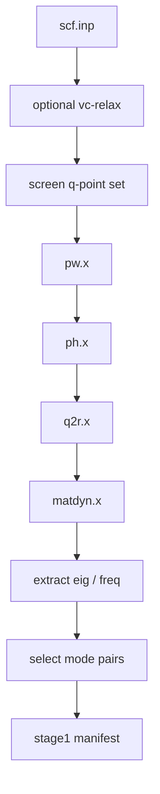

# QE Phonon Stage1 Runtime

This directory is the real `stage1` runtime used by the stable bundle.

It is responsible for the phonon frontend only. It does not run CHGNet
screening and it does not prepare QE top-5 recheck jobs.

## What Stage1 Produces

`stage1` starts from a structure input and produces the files needed for the
rest of the workflow:

- `qeph.eig`
- `qeph.freq`
- screened q-point data
- `selected_mode_pairs.json`
- `stage1_manifest.json`

Those outputs are later handed to `stage2`.

## Quick Start

This runtime is intended for:

- host: a Slurm machine suitable for the QE phonon frontend
- scheduler: Slurm

Recommended order:

```bash
python3 assess_stage1_env.py
python3 run_all.py
```

`assess_stage1_env.py` probes:

- QE executables
- Slurm partitions
- launcher availability
- stage-specific node and task layout

`run_all.py` executes the actual stage1 flow.

## Runtime Flow



## Default Stable Parameters

The stable default phonon profile is the convergence-tested balanced set:

- `ecutwfc = 100`
- `ecutrho = 1000`
- `primitive_k_mesh = 12x12x1`
- `conv_thr = 1.0d-10`
- `degauss = 1.0d-10`
- `q-grid = 6x6x1`

The optional pre-relax step keeps the stricter defaults used by the release
launcher.

## Default Resource Split

Resources are assigned per frontend stage, not by one global MPI setting:

- `pw`: `1 node x 24 MPI`
- `ph`: `4 nodes x 24 MPI`
- `q2r`: `1 node x 1 MPI`
- `matdyn`: `1 node x 24 MPI`

This split matters because `ph.x` and `matdyn.x` do not scale in the same way.

## Main Outputs

The runtime writes under:

```bash
qe_phonon_pes_run/
```

Key files:

- `qe_phonon_pes_run/frontend_manifest.json`
- `qe_phonon_pes_run/results/stage1_env_assessment.json`
- `qe_phonon_pes_run/results/stage1_env_assessment.md`
- `qe_phonon_pes_run/results/stage1_runtime_config.json`
- `qe_phonon_pes_run/results/stage1_summary.json`
- `qe_phonon_pes_run/matdyn/qeph.eig`
- `qe_phonon_pes_run/matdyn/qeph.freq`

When stage1 is used through the stable release launcher, the later packaging
step converts these frontend outputs into:

- `release_run/stage1_inputs/mode_pairs/selected_mode_pairs.json`
- `release_run/stage1_manifest.json`

## Notes

- The stable source bundle intentionally does not ship prebuilt `inputs/`,
  `qe_phonon_pes_run/`, or validation snapshots.
- The runtime assessment is part of normal operation. It is not just a debug
  helper.
- The bundle no longer treats precomputed mode-pair outputs as the default
  stage1 path.
