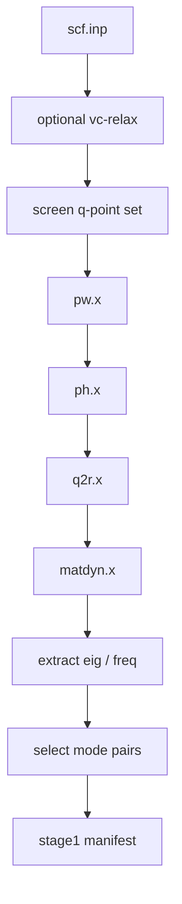

# QE Phonon Stage1 Runtime

This directory is the real `stage1` runtime used by the beta workflow.

It is responsible for the phonon frontend only. It does not run CHGNet
screening and it does not prepare QE top-5 recheck jobs.

## What Stage1 Produces

`stage1` starts from a structure input and produces the files needed for the
rest of the workflow:

- `qeph.eig`
- `qeph.freq`
- screened q-point data
- `selected_mode_pairs.json`
- `stage1_manifest.json`

Those outputs are later handed to `stage2`.

The q-point screening, eigenvector extraction, mode selection, and mode-pair
generation helpers now live here as `qpair_tools/`. They are no longer split
out into a separate top-level workflow directory.

## Quick Start

This runtime is intended for:

- host: a Slurm machine suitable for the QE phonon frontend
- scheduler: Slurm

Recommended order:

```bash
python3 ops/assess_stage1_env.py
python3 run_all.py
```

`ops/assess_stage1_env.py` probes:

- QE executables
- Slurm partitions
- launcher availability
- stage-specific node and task layout

`run_all.py` executes the actual stage1 flow.

The beta launcher also exposes a separate tuning path:

```bash
python3 ../start_release.py --input-root <input_root> --system <system_id> --stage tune
```

That route runs `convergence/autotune.py`, selects profiles by
`workflow_family`, and writes:

```text
qe_phonon_pes_run/results/selected_profiles.json
```

`step1_frontend.py` will consume that file automatically when it exists.

For TMDS monolayers, the phonon-side selection now uses stricter geometry and
force thresholds than the earlier beta draft. The intent is to keep the
phonon frontend on the tighter side and only relax thresholds modestly as a
fallback.

## Runtime Flow



## Default Stable Parameters

The stable default phonon profile is the convergence-tested balanced set:

- `ecutwfc = 100`
- `ecutrho = 1000`
- `primitive_k_mesh = 12x12x1`
- `conv_thr = 1.0d-10`
- `degauss = 1.0d-10`
- `q-grid = 6x6x1`

The optional pre-relax step keeps the stricter defaults used by the release
launcher.

## Default Resource Split

Resources are assigned per frontend stage, not by one global MPI setting:

- `pw`: `1 node x 48 MPI`
- `ph`: `1 node x 24 MPI`
- `q2r`: `1 node x 48 MPI`
- `matdyn`: `1 node x 48 MPI`

This split matters because `ph.x` and `matdyn.x` do not scale in the same way.

## Main Outputs

The runtime writes under:

```bash
qe_phonon_pes_run/
```

Key files:

- `qe_phonon_pes_run/frontend_manifest.json`
- `qe_phonon_pes_run/results/stage1_env_assessment.json`
- `qe_phonon_pes_run/results/stage1_env_assessment.md`
- `qe_phonon_pes_run/results/stage1_runtime_config.json`
- `qe_phonon_pes_run/results/stage1_summary.json`
- `qe_phonon_pes_run/matdyn/qeph.eig`
- `qe_phonon_pes_run/matdyn/qeph.freq`

When stage1 is used through the beta launcher, those frontend outputs are
converted into:

- `stage1/outputs/mode_pairs.selected.json`
- `contracts/stage1.manifest.json`

## Notes

- The stable source bundle intentionally does not ship prebuilt `inputs/`,
  `qe_phonon_pes_run/`, or validation snapshots.
- The runtime assessment is part of normal operation. It is not just a debug
  helper.
- The bundle no longer treats precomputed mode-pair outputs as the default
  stage1 path.
