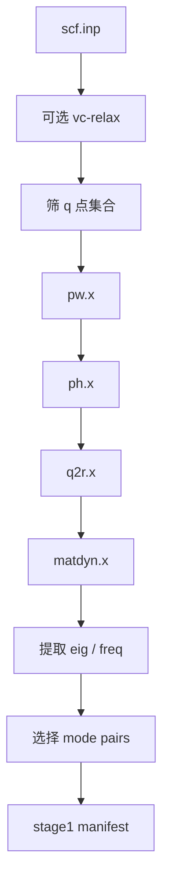

# QE 声子 Stage1 运行时

这个目录就是稳定版里真实的 `stage1`。

它只负责声子前端，不负责 CHGNet 筛选，也不负责 QE top5 复核。

## Stage1 最终会产出什么

`stage1` 从结构输入出发，最终产出后续阶段真正需要的内容：

- `qeph.eig`
- `qeph.freq`
- q 点筛选结果
- `selected_mode_pairs.json`
- `stage1_manifest.json`

这些东西之后会交给 `stage2`。

## Quick Start

这个运行时默认对应：

- 宿主：`159.226.208.67:33223`
- 调度器：Slurm

推荐顺序：

```bash
python3 assess_stage1_env.py
python3 run_all.py
```

`assess_stage1_env.py` 会探测：

- QE 可执行文件
- Slurm 分区
- launcher 可用性
- 各个 frontend 子步骤的资源布局

`run_all.py` 才是真正执行 stage1 的入口。

## 运行流程



## 当前稳定版默认参数

稳定版默认声子参数是前面收敛测试选出来的 `phonon.balanced`：

- `ecutwfc = 100`
- `ecutrho = 1000`
- `primitive_k_mesh = 12x12x1`
- `conv_thr = 1.0d-10`
- `degauss = 1.0d-10`
- `q-grid = 6x6x1`

如果走 release launcher 里的预松弛，前面的 `vc-relax` 仍然保持更严格的默认值。

## 当前默认资源拆分

资源是按 frontend 子步骤拆开的，不是全程用一套 MPI：

- `pw`：`1 node x 24 MPI`
- `ph`：`4 nodes x 24 MPI`
- `q2r`：`1 node x 1 MPI`
- `matdyn`：`1 node x 24 MPI`

这样做是因为 `ph.x` 和 `matdyn.x` 的并行行为本来就不一样。

## 主要输出

运行目录写在：

```bash
qe_phonon_pes_run/
```

关键文件有：

- `qe_phonon_pes_run/frontend_manifest.json`
- `qe_phonon_pes_run/results/stage1_env_assessment.json`
- `qe_phonon_pes_run/results/stage1_env_assessment.md`
- `qe_phonon_pes_run/results/stage1_runtime_config.json`
- `qe_phonon_pes_run/results/stage1_summary.json`
- `qe_phonon_pes_run/matdyn/qeph.eig`
- `qe_phonon_pes_run/matdyn/qeph.freq`

当这层通过稳定版 launcher 进入后续打包步骤时，会进一步生成：

- `release_run/stage1_inputs/mode_pairs/selected_mode_pairs.json`
- `release_run/stage1_manifest.json`

## 说明

- 稳定版源码包不会自带预先生成好的 `inputs/`、`qe_phonon_pes_run/` 或验证快照。
- 环境探测不是额外调试工具，而是正常运行流程的一部分。
- 稳定版已经不再把预置 mode-pair 文件当作默认 stage1 路径。
