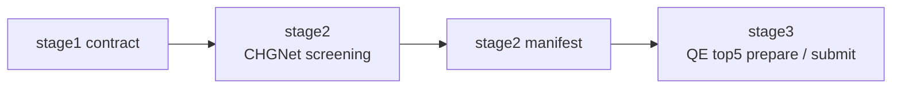

# Server High-Throughput Workflow

This directory contains the runtime used for `stage2` and `stage3`.

It assumes that `stage1` has already produced a contract package and that you
want to continue from that contract on another machine.

Default host split:

- `stage1`: a Slurm host for the QE phonon frontend
- `stage2/3`: a machine used for CHGNet screening and QE batch recheck

The package does not SSH between hosts. You copy the handoff files yourself and
resume from them.

## Quick Start

From the bundle root on the stage2/3 machine:

```bash
bash server_highthroughput_workflow/bootstrap_server_env.sh
python3 server_highthroughput_workflow/assess_chgnet_env.py
python3 server_highthroughput_workflow/run_modular_pipeline.py \
  --stage stage2 \
  --run-root /path/to/release_run \
  --runtime-profile medium
python3 server_highthroughput_workflow/run_modular_pipeline.py \
  --stage stage3 \
  --run-root /path/to/release_run \
  --qe-mode submit_collect
```

If you only want to verify the QE directory generation and submission logic:

```bash
python3 server_highthroughput_workflow/run_modular_pipeline.py \
  --stage stage3 \
  --run-root /path/to/release_run \
  --qe-mode prepare_only
```

## What This Layer Reads

### Stage 2 input

`stage2` reads:

- `stage1_manifest.json`
- `stage1_inputs/`

That means:

- `scf.inp`
- pseudos
- `selected_mode_pairs.json`

must already exist inside the run root you provide.

### Stage 3 input

`stage3` reads:

- `stage2_manifest.json`

and then resolves the stage1 contract paths referenced by that manifest.

This is the rule for the stable bundle:

- `stage2` depends on the stage1 contract
- `stage3` depends on the stage2 contract
- neither stage depends on hidden local history

## How The Runtime Is Organized



The most important files here are:

- `bootstrap_server_env.sh`
  - prepares the `qiyan-ht` conda environment
- `assess_chgnet_env.py`
  - benchmarks CHGNet CPU inference on the current machine
  - inspects live Slurm partition settings
- `scheduler.py`
  - resolves `auto | slurm | local`
- `run_modular_pipeline.py`
  - stage-aware runner for `stage1 | stage2 | stage3 | all`
- `run_server_pipeline.py`
  - controller for the screening-to-QE path
- `stage_contracts.py`
  - manifest schema and handoff helpers

## Runtime Selection Rules

For CHGNet screening, runtime settings are resolved in this order:

1. `--runtime-config`
2. `--runtime-profile`
3. `server_highthroughput_workflow/env_reports/chgnet_runtime_config.json`
4. `server_highthroughput_workflow/portable_cpu_config.json`
5. built-in CPU heuristics

This means a machine can be tuned once and then reused without re-editing the
workflow scripts.

Useful overrides:

- `--runtime-profile small|medium|large|default`
- `--runtime-config /path/to/runtime.json`
- `--scheduler auto|slurm|local`
- `--qe-mode prepare_only|submit_collect`

## Default Screening Behavior

The stable default path is:

- `backend = chgnet`
- `strategy = coarse_to_fine`
- `coarse_grid_size = 5`
- `full_grid_size = 9`
- `refine_top_k = 24`
- `batch_size = 16`
- `num_workers = 2`
- `torch_threads = 16`

The output ranking is written under:

```bash
release_run/stage2_outputs/chgnet/screening/
```

## Default Stage3 Behavior

The stable default path is:

- `top_n = 5`
- QE preset `pes_fast`

The key outputs are:

- `release_run/stage3_manifest.json`
- `release_run/stage3_qe/chgnet/run_manifest.json`
- `release_run/stage3_qe/chgnet/modular_stage3_status.json`

`stage3_manifest.json` is written immediately after the QE batch is prepared.

## Typical Commands

### Stage 2 only

```bash
python3 server_highthroughput_workflow/run_modular_pipeline.py \
  --stage stage2 \
  --run-root /path/to/release_run \
  --runtime-profile medium
```

### Stage 3 prepare only

```bash
python3 server_highthroughput_workflow/run_modular_pipeline.py \
  --stage stage3 \
  --run-root /path/to/release_run \
  --qe-mode prepare_only
```

### Stage 3 submit and collect

```bash
python3 server_highthroughput_workflow/run_modular_pipeline.py \
  --stage stage3 \
  --run-root /path/to/release_run \
  --qe-mode submit_collect
```

### Manual environment assessment

```bash
python3 server_highthroughput_workflow/assess_chgnet_env.py
source server_highthroughput_workflow/env_reports/slurm_submit_defaults.sh
```

## Notes

- If Slurm is unavailable and `--scheduler auto` is used, the runtime falls
  back to local screening.
- If the default partition or walltime is invalid for the current cluster, the
  runtime probes the live Slurm configuration and resolves a usable fallback.
- This stable bundle no longer depends on the removed golden-reference dataset.
