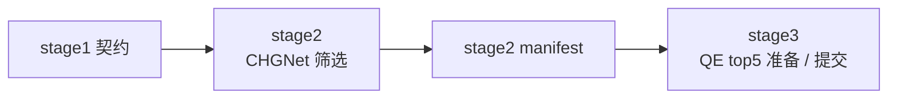

# 服务器高通量工作流

这个目录负责 `stage2` 和 `stage3`。

它的前提是：`stage1` 已经在别的地方完成，并且你已经拿到了标准 handoff 文件。接下来这层只负责继续往下跑，不负责回头重做声子前端。

当前默认机器分工是：

- `stage1`：适合 QE 声子前端的 Slurm 机器
- `stage2/3`：适合 CHGNet 筛选和 QE 批量复核的机器

包内不会自动 SSH 到上游机器，而是要求你把契约文件复制过来，然后继续执行。

## Quick Start

在 `stage2/3` 机器上的 bundle 根目录执行：

```bash
bash server_highthroughput_workflow/bootstrap_server_env.sh
python3 server_highthroughput_workflow/assess_chgnet_env.py
python3 server_highthroughput_workflow/run_modular_pipeline.py \
  --stage stage2 \
  --run-root /path/to/release_run \
  --runtime-profile medium
python3 server_highthroughput_workflow/run_modular_pipeline.py \
  --stage stage3 \
  --run-root /path/to/release_run \
  --qe-mode submit_collect
```

如果你此时只想确认 QE 目录和提交逻辑是否正确，不想马上交整批任务：

```bash
python3 server_highthroughput_workflow/run_modular_pipeline.py \
  --stage stage3 \
  --run-root /path/to/release_run \
  --qe-mode prepare_only
```

## 这层读取什么

### Stage 2 的输入

`stage2` 读取：

- `stage1_manifest.json`
- `stage1_inputs/`

也就是说，`stage2` 真正需要的是：

- `scf.inp`
- 伪势
- `selected_mode_pairs.json`

### Stage 3 的输入

`stage3` 读取：

- `stage2_manifest.json`

然后再沿着 manifest 回到 `stage1` 契约里去找结构、伪势和 mode pairs。

稳定版现在的设计规则很简单：

- `stage2` 只依赖 `stage1` 契约
- `stage3` 只依赖 `stage2` 契约
- 不靠隐藏的本地历史目录继续跑

## 这层是怎么工作的



这里最重要的脚本和文件是：

- `bootstrap_server_env.sh`
  - 准备 `qiyan-ht` conda 环境
- `assess_chgnet_env.py`
  - 在当前机器上评估 CHGNet CPU 推理速度
  - 识别实时 Slurm 分区配置
- `scheduler.py`
  - 处理 `auto | slurm | local`
- `run_modular_pipeline.py`
  - `stage1 | stage2 | stage3 | all` 的分阶段入口
- `run_server_pipeline.py`
  - screening 到 QE 的控制器
- `stage_contracts.py`
  - handoff manifest 的结构定义

## 运行时配置优先级

CHGNet 筛选这层会按下面顺序选 runtime 配置：

1. `--runtime-config`
2. `--runtime-profile`
3. `server_highthroughput_workflow/env_reports/chgnet_runtime_config.json`
4. `server_highthroughput_workflow/portable_cpu_config.json`
5. 脚本内置 CPU 推断

所以一台机器只要 benchmark 一次，后面就可以直接复用，不需要每次手改参数。

常用覆盖项：

- `--runtime-profile small|medium|large|default`
- `--runtime-config /path/to/runtime.json`
- `--scheduler auto|slurm|local`
- `--qe-mode prepare_only|submit_collect`

## 当前默认筛选策略

稳定版默认配置是：

- `backend = chgnet`
- `strategy = coarse_to_fine`
- `coarse_grid_size = 5`
- `full_grid_size = 9`
- `refine_top_k = 24`
- `batch_size = 16`
- `num_workers = 2`
- `torch_threads = 16`

筛选结果会写到：

```bash
release_run/stage2_outputs/chgnet/screening/
```

## 当前默认 stage3 行为

稳定版默认是：

- `top_n = 5`
- QE preset `pes_fast`

关键输出是：

- `release_run/stage3_manifest.json`
- `release_run/stage3_qe/chgnet/run_manifest.json`
- `release_run/stage3_qe/chgnet/modular_stage3_status.json`

现在 `stage3_manifest.json` 会在 QE 批任务准备完成后立即写出。

## 常用命令

### 只跑 stage2

```bash
python3 server_highthroughput_workflow/run_modular_pipeline.py \
  --stage stage2 \
  --run-root /path/to/release_run \
  --runtime-profile medium
```

### 只做 stage3 准备

```bash
python3 server_highthroughput_workflow/run_modular_pipeline.py \
  --stage stage3 \
  --run-root /path/to/release_run \
  --qe-mode prepare_only
```

### stage3 直接提交并回收

```bash
python3 server_highthroughput_workflow/run_modular_pipeline.py \
  --stage stage3 \
  --run-root /path/to/release_run \
  --qe-mode submit_collect
```

### 手动做环境评估

```bash
python3 server_highthroughput_workflow/assess_chgnet_env.py
source server_highthroughput_workflow/env_reports/slurm_submit_defaults.sh
```

## 几个现实说明

- 如果机器没有 Slurm，`--scheduler auto` 会退化成 local screening。
- 如果 bundle 默认 partition / walltime 不适配当前集群，运行时会先探测 Slurm，再回退到可用设置。
- 稳定版已经去掉黄金参考数据，不再把它当运行刚需。
